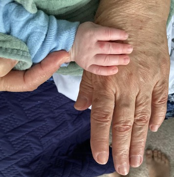
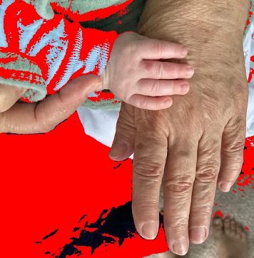
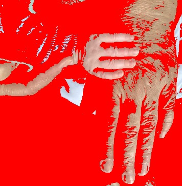
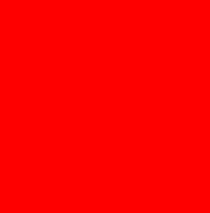
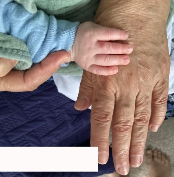
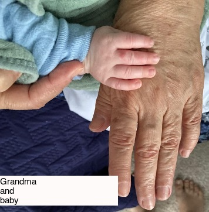
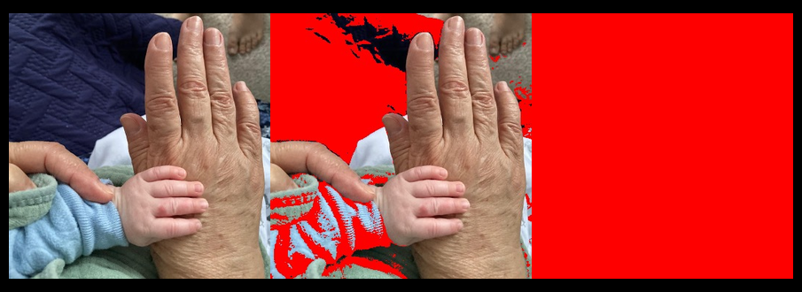
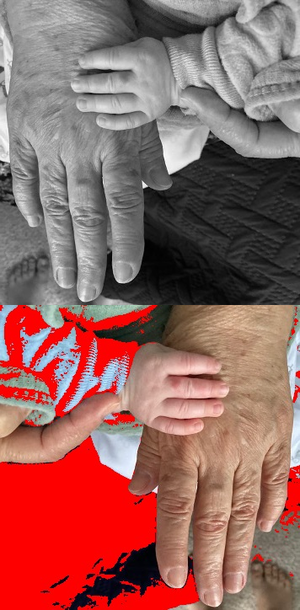
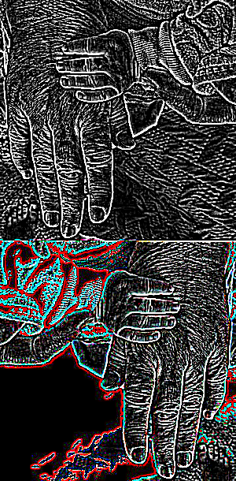

# Manipulating image files

## ImageMagick (linux, Mac)

### Installation

Go to the [ImageMagic installation page](https://imagemagick.org/script/download.php) for detailed instructions for different operating systems.

### Utilities

ImageMagick has a list of utilities that can be used for different purposes. The following table presents a summary of those utilities. Then, I will show some examples for each of these utilities. These examples will help you better understand how to use them.

When specifying a color in any ImageMagick command, you can use the name of any [recognized color](#imagemagick-color-list), the RGB value, or the Hex value.

When specifying a shape to draw on an image, you can use any of the [valid shapes](#imagemagick-shapes).

| Utility | Use | Syntax | Links |
| --- | --- | --- | --- |
| `magick` | This command now replaces `convert`, which is deprecated. Change image format, blur, crop, draw on, flip, merge, resample, and more. Writes output on a new file. | `magick [input-options] input-file(s) [output-options] output-file` | [Man page](https://docs.oracle.com/cd/E88353_01/html/E37839/convert-1.html), [Documentation](https://imagemagick.org/script/convert.php) |
| `identify` | Obtain information about an image. | `identify [options] input-file` | [Man page](https://docs.oracle.com/cd/E88353_01/html/E37839/identify-1.html), [Documentation](http://imagemagick.org/script/identify.php) |
| `mogrify` | Resize an image, blur, crop, draw on, flip, merge, resample, and more. Re-writes original file. | `mogrify [options] input-file` | [Man page](https://docs.oracle.com/cd/E88353_01/html/E37839/mogrify-1.html), [Documentation](http://imagemagick.org/script/mogrify.php) |
| `composite` | Overlaps one image over another. | `composite  [  options ... ] change-file base-file [ mask-file ] output-image` | [Man page](https://docs.oracle.com/cd/E88353_01/html/E37839/composite-1.html), [Documentation](http://imagemagick.org/script/composite.php) |
| `montage` | Combines different images, adds border, frame, and much more. | `montage input-file[s] [options] output-file` | [Man page](https://docs.oracle.com/cd/E88353_01/html/E37839/montage-1.html), [Documentation](http://imagemagick.org/script/montage.php) |
| `compare` | Compare two images. | `compare input-file input-file [options] output-file` | [Man page](https://docs.oracle.com/cd/E88353_01/html/E37839/compare-1.html), [Documentation](http://imagemagick.org/script/compare.php) |
| `stream` | Writes the pixel components of an img a row at a time into different storage formats. | `compare input-file input-file [options] output-file` | [Man page](https://docs.oracle.com/cd/E88353_01/html/E37839/stream-1.html), [Documentation](http://imagemagick.org/script/stream.php) |
| `display` | Displays an image or image sequence. | `display [options] input-file` | [Man page](https://docs.oracle.com/cd/E88353_01/html/E37839/display-1.html), [Documentation](http://imagemagick.org/script/display.php) |
| `animate` | Animates an image sequence. | `animate [options] input-file` | [Man page](https://docs.oracle.com/cd/E88353_01/html/E37839/animate-1.html), [Documentation](http://imagemagick.org/script/animate.php) |
| `import` | Saves  any  visible  window as an img file. Captures a single window, the entire screen, or any rectangular portion of the screen. | `import [options] output-file` | [Man page](https://docs.oracle.com/cd/E88353_01/html/E37839/import-1.html), [Documentation](http://imagemagick.org/script/import.php) |
| `conjure` | Interprets and executes scripts written in the Magick Scripting Language (MSL). | `conjure [options] script.msl` | [Man page](https://docs.oracle.com/cd/E88353_01/html/E37839/conjure-1.html), [Documentation](http://imagemagick.org/script/conjure.php) |

### Examples

In the following examples we will use this image:



#### `magick`

Syntax: `magick [input-option] input-file [output-option] output-file`

**Changing the color of pixels:**

In the following example we are replacing all pixels that have a distance of at most 50%, 60% and 100% from 255 in the blue value of their RGB:

```bash
magick grandma.jpg -fuzz 50% -fill "red" -opaque "blue" grandma_50.jpg
magick grandma.jpg -fuzz 60% -fill "red" -opaque "blue" grandma_60.jpg
magick grandma.jpg -fuzz 100% -fill "red" -opaque "blue" grandma_100.jpg
```

Meaning of used options:

1. `fuzz`: Distance from 255 in those pixels to be matched.
    - 50% means any pixel with blue value between 127.5 (50% of 255) and 255.
    - 60% means any pixel with blue value between 102 and 255. 60% of 255 is 153, and 255-153=102. Any pixel with blue value within this range will be at most 60% away from being 100% blue.
    - 100% means any pixel with blue value at most 100% away from being 100% blue, this includes all pixels in the image.
2. `opaque`: Color to be replaced. See the list of [recognized colors](#imagemagick-color-list).

Output with 50% of fuzz:



Output with 60% of fuzz:



Output with 100% of fuzz:



You can also change the color of pixels in a specific area:

```bash
magick grandma.jpg -fill "rgb(255,250,250)" -draw "rectangle 0,300 200,350" grandma_rect.jpg
```

Meaning of used options:

1. `fill`: Color to fill the form. See the list of [recognized colors](#imagemagick-color-list).
2. `draw`: Shape to draw. See list of [valid shapes and their parameters](#imagemagick-shapes).

Output:



**Add text over the rectangle drawn on the image above:**

```bash
magick grandma_rect.jpg -font helvetica -fill black -pointsize 15 -draw "text 0,315 'Grandma\nand\nbaby'" grandma_rect_txt.png
```

Meaning of used options:

1. `font`: Font for the text. To see the list of all available fonts type `magick -list font`.
2. `fill`: Color to fill the form, in this case the text. See the list of [recognized colors](#imagemagick-color-list).
3. `pointsize`: Text size.
4. `draw`: Shape to draw. See list of [valid shapes and their parameters](#imagemagick-shapes).

Output:



**Concatenate images horizontally:**

In the following example I will concatenate some images (`grandma.jpg grandma_50.jpg grandma_100.jpg`) horizontally, add a border, and flip the image along the horizontal axis.

```bash
magick grandma.jpg grandma_50.jpg grandma_100.jpg +append -resize x300 -bordercolor black -border 10x15 -flip horizontal.png
```

Meaning of used options:

1. `resize`: Force the output file to have a *height* of 300 pixels. If the input images have different heights, then this parameter is recommended. Otherwise, the output will have the same height as the input files if this parameter is not used.
2. `bordercolor`: Color of the border. See the list of [recognized colors](#imagemagick-color-list).
3. `border`: Add a border with the specified thickness. In this case we are adding a border with a thickness of 10 pixels on the left and right and 15 pixels on the top and bottom.
4. `flip`: I'm flipping the *output* image along the *horizontal axis*. To flip the image along the vertical axis, use `-flop`. Make sure to insert the `flip` flag after `+append` to apply the flip to the output instead of any of the input files. See example below on how to apply `flip` or `flop` to the input instead of output files.

Output:



**Concatenate images vertically:**

In the following example I will concatenate some images (`grandma.jpg` and `grandma_50.jpg`) horizontally. *Before* the concatenation, I will flip the first input file along the vertical axis and transform the color space to Gray.

```bash
magick grandma.jpg -colorspace Gray -flop grandma_50.jpg -append -resize 300x vertical.png
```

Meaning of used options:

1. `colorspace`: Color space to apply to the *input* image. It will apply to any input image specified before the flag, in this case `grandma.jpg`. If we wanted the whole output file to be on Gray scale, we would add the flag at the end of all input images. Available color spaces: `sRGB`, `RGB`, `Gray`, `HSV`, `HSB`, `HSL`, `LAB`, `LCH`, `CMYK`, `XYZ`, `YUV`, `YCbCr`, `AdobeRGB`, plus others.
2. `flop`: I'm flipping the *input* image (grandma.jpg) along the *vertical axis*. To flip the image along the horizontal axis, use `flip`.
3. `resize`: Force the output file to have a *width* of 300 pixels. If the input images have different widths, then this parameter is recommended. Otherwise, the output will have the same width as the input files if this parameter is not used.

Output:



**Detect edges:**

In the following example I will detect edges in the image generated in the example above using two methods: the standard edge detection with the `-edge` flag, and the Canny Edge detection with smoothing using `-canny`. `-canny` is more sophisticated and allows for modifying the radius, sigma and threshold for filtering out edges.

```bash
magick vertical.png -edge 2 edges.png
magick vertical.png -canny 0x1+10%+30% edges2.png
```

Meaning of used options:

1. `-edge 2`: Apply an edge of radius 2. To make the edges thicker, increment the value of `2`, or to make them thinner, give a value of `1`.
2. `-canny 0x1+10%+30%`: Apply Canny Edge Detection with smoothing. The arguments here set the radius to 0 (auto-determined) and sigma to 1. Increase sigma for more smoothing. 10% and 30% are the lower and upper percentage thresholds for edge detection. Play around with these values to filter out weaker edges and highlight more important ones. Increasing the upper percentage will remove more edges.

Output using `-edge`:



Output using `-canny`:


#### `identify`

#### `mogrify`

#### `composite`

#### `montage`

#### `compare`

#### `stream`

#### `display`

#### `animate`

#### `import`

#### `conjure`

### ImageMagick shapes

| Shape | Syntax | Notes |
| --- | --- | --- |
| Point | `point x,y` | Specified by an ordered pair of integer coordinates. |
| Line | `line x0,y0 x1,y1` | Requires a start and end point. |
| Rectangle | `rectangle x0,y0 x1,y1` | Specified by the pair of points at the upper left and lower right corners. |
| Round rectangle | `roundRectangle x0,y0, x1,y1 wc,hc` | Takes same corner points as `rectangle`, followed by the width and height of the rounded corners to be removed. |
| Arc | `arc x0,y0 x1,y1 a0,a1` | Requires two corners used to create a `rectangle`, followed by the start and end angles of the arc in degrees. |
| Ellipse | `ellipse x0,y0 rx,ry a0,a1` | Requires the center point, the horizontal and vertical radius, and the start and end angles in degrees. |
| Circle | `circle x0,y0 x1,y1` | Give the center and any point on the perimeter. Can make a disk (filled) or circle (unfilled). |
| Polyline | `polyline x0,y0 ... xn,yn` | Requires three or more points to define their perimeters. This is simply a polygon in which the final point is not stroked to the start point. |
| Polygon | `polygon x0,y0 ... xn,yn` | Requires three or more points to define their perimeters. |
| Bezier | `bezier x0,y0 ... xn,yn` | Creates a spline curve and requires three or points to define its shape. The first and last points are the knots and these points are attained by the curve, while any intermediate coordinates are control points. |
| Path | `path specification` | represents an outline of an object, defined in terms of `moveto` (set a new current point), `lineto` (draw a straight line), `curveto` (draw a Bezier curve), arc (elliptical or circular arc) and `closepath` (close the current shape by drawing a line to the last `moveto`) elements. |
| Image | `image operator x0,y0 w,h filename` | Used to composite an image with another image. |
| Text | `text x,y text_to_display` | Add text in coordinates x,y of image. |

### ImageMagick color list

| Color name | RGB | Hex | Sample |
| --- | --- | --- | --- |
| snow | | | |
| snow1 | | | |
| snow2 | | | |
| RosyBrown1 | | | |
| RosyBrown2 | | | |
| snow3 | | | |
| LightCoral | | | |
| IndianRed1 | | | |
| RosyBrown3 | | | |
| IndianRed2 | | | |
| RosyBrown | | | |
| brown1 | | | |
| firebrick1 | | | |
| brown2 | | | |
| IndianRed | | | |
| IndianRed3 | | | |
| firebrick2 | | | |
| snow4 | | | |
| brown3 | | | |
| red | | | |
| red1 | | | |
| RosyBrown4 | | | |
| firebrick3 | | | |
| red2 | | | |
| firebrick | | | |
| brown | | | |
| red3 | | | |
| IndianRed4 | | | |
| brown4 | | | |
| firebrick4 | | | |
| DarkRed | | | |
| red4 | | | |
| maroon | | | |
| LightPink1 | | | |
| LightPink3 | | | |
| LightPink4 | | | |
| LightPink2 | | | |
| LightPink | | | |
| pink | | | |
| crimson | | | |
| pink1 | | | |
| pink2 | | | |
| pink3 | | | |
| pink4 | | | |
| PaleVioletRed4 | | | |
| PaleVioletRed | | | |
| PaleVioletRed2 | | | |
| PaleVioletRed1 | | | |
| PaleVioletRed3 | | | |
| LavenderBlush | | | |
| LavenderBlush1 | | | |
| LavenderBlush3 | | | |
| LavenderBlush2 | | | |
| LavenderBlush4 | | | |
| maroon | | | |
| HotPink3 | | | |
| VioletRed3 | | | |
| VioletRed1 | | | |
| VioletRed2 | | | |
| VioletRed4 | | | |
| HotPink2 | | | |
| HotPink1 | | | |
| HotPink4 | | | |
| HotPink | | | |
| DeepPink | | | |
| DeepPink1 | | | |
| DeepPink2 | | | |
| DeepPink3 | | | |
| DeepPink4 | | | |
| maroon1 | | | |
| maroon2 | | | |
| maroon3 | | | |
| maroon4 | | | |
| MediumVioletRed | | | |
| VioletRed | | | |
| orchid2 | | | |
| orchid | | | |
| orchid1 | | | |
| orchid3 | | | |
| orchid4 | | | |
| thistle1 | | | |
| thistle2 | | | |
| plum1 | | | |
| plum2 | | | |
| thistle | | | |
| thistle3 | | | |
| plum | | | |
| violet | | | |
| plum3 | | | |
| thistle4 | | | |
| fuchsia | | | |
| magenta | | | |
| magenta1 | | | |
| plum4 | | | |
| magenta2 | | | |
| magenta3 | | | |
| DarkMagenta | | | |
| magenta4 | | | |
| purple | | | |
| MediumOrchid | | | |
| MediumOrchid1 | | | |
| MediumOrchid2 | | | |
| MediumOrchid3 | | | |
| MediumOrchid4 | | | |
| DarkViolet | | | |
| DarkOrchid | | | |
| DarkOrchid1 | | | |
| DarkOrchid3 | | | |
| DarkOrchid2 | | | |
| DarkOrchid4 | | | |
| purple | | | |
| indigo | | | |
| BlueViolet | | | |
| purple2 | | | |
| purple3 | | | |
| purple4 | | | |
| purple1 | | | |
| MediumPurple | | | |
| MediumPurple1 | | | |
| MediumPurple2 | | | |
| MediumPurple3 | | | |
| MediumPurple4 | | | |
| DarkSlateBlue | | | |
| LightSlateBlue | | | |
| MediumSlateBlue | | | |
| SlateBlue | | | |
| SlateBlue1 | | | |
| SlateBlue2 | | | |
| SlateBlue3 | | | |
| SlateBlue4 | | | |
| GhostWhite | | | |
| lavender | | | |
| blue | | | |
| blue1 | | | |
| blue2 | | | |
| blue3 | | | |
| MediumBlue | | | |
| blue4 | | | |
| DarkBlue | | | |
| MidnightBlue | | | |
| navy | | | |
| NavyBlue | | | |
| RoyalBlue | | | |
| RoyalBlue1 | | | |
| RoyalBlue2 | | | |
| RoyalBlue3 | | | |
| RoyalBlue4 | | | |
| CornflowerBlue | | | |
| LightSteelBlue | | | |
| LightSteelBlue1 | | | |
| LightSteelBlue2 | | | |
| LightSteelBlue3 | | | |
| LightSteelBlue4 | | | |
| SlateGray4 | | | |
| SlateGray1 | | | |
| SlateGray2 | | | |
| SlateGray3 | | | |
| LightSlateGray | | | |
| LightSlateGrey | | | |
| SlateGray | | | |
| SlateGrey | | | |
| DodgerBlue | | | |
| DodgerBlue1 | | | |
| DodgerBlue2 | | | |
| DodgerBlue4 | | | |
| DodgerBlue3 | | | |
| AliceBlue | | | |
| SteelBlue4 | | | |
| SteelBlue | | | |
| SteelBlue1 | | | |
| SteelBlue2 | | | |
| SteelBlue3 | | | |
| SkyBlue4 | | | |
| SkyBlue1 | | | |
| SkyBlue2 | | | |
| SkyBlue3 | | | |
| LightSkyBlue | | | |
| LightSkyBlue4 | | | |
| LightSkyBlue1 | | | |
| LightSkyBlue2 | | | |
| LightSkyBlue3 | | | |
| SkyBlue | | | |
| LightBlue3 | | | |
| DeepSkyBlue | | | |
| DeepSkyBlue1 | | | |
| DeepSkyBlue2 | | | |
| DeepSkyBlue4 | | | |
| DeepSkyBlue3 | | | |
| LightBlue1 | | | |
| LightBlue2 | | | |
| LightBlue | | | |
| LightBlue4 | | | |
| PowderBlue | | | |
| CadetBlue1 | | | |
| CadetBlue2 | | | |
| CadetBlue3 | | | |
| CadetBlue4 | | | |
| turquoise1 | | | |
| turquoise2 | | | |
| turquoise3 | | | |
| turquoise4 | | | |
| cadet blue | | | |
| CadetBlue | | | |
| DarkTurquoise | | | |
| azure | | | |
| azure1 | | | |
| LightCyan | | | |
| LightCyan1 | | | |
| azure2 | | | |
| LightCyan2 | | | |
| PaleTurquoise1 | | | |
| PaleTurquoise | | | |
| PaleTurquoise2 | | | |
| DarkSlateGray1 | | | |
| azure3 | | | |
| LightCyan3 | | | |
| DarkSlateGray2 | | | |
| PaleTurquoise3 | | | |
| DarkSlateGray3 | | | |
| azure4 | | | |
| LightCyan4 | | | |
| aqua | | | |
| cyan | | | |
| cyan1 | | | |
| PaleTurquoise4 | | | |
| cyan2 | | | |
| DarkSlateGray4 | | | |
| cyan3 | | | |
| cyan4 | | | |
| DarkCyan | | | |
| teal | | | |
| DarkSlateGray | | | |
| DarkSlateGrey | | | |
| MediumTurquoise | | | |
| LightSeaGreen | | | |
| turquoise | | | |
| aquamarine4 | | | |
| aquamarine | | | |
| aquamarine1 | | | |
| aquamarine2 | | | |
| aquamarine3 | | | |
| MediumAquamarine | | | |
| MediumSpringGreen | | | |
| MintCream | | | |
| SpringGreen | | | |
| SpringGreen1 | | | |
| SpringGreen2 | | | |
| SpringGreen3 | | | |
| SpringGreen4 | | | |
| MediumSeaGreen | | | |
| SeaGreen | | | |
| SeaGreen3 | | | |
| SeaGreen1 | | | |
| SeaGreen4 | | | |
| SeaGreen2 | | | |
| MediumForestGreen | | | |
| honeydew | | | |
| honeydew1 | | | |
| honeydew2 | | | |
| DarkSeaGreen1 | | | |
| DarkSeaGreen2 | | | |
| PaleGreen1 | | | |
| PaleGreen | | | |
| honeydew3 | | | |
| LightGreen | | | |
| PaleGreen2 | | | |
| DarkSeaGreen3 | | | |
| DarkSeaGreen | | | |
| PaleGreen3 | | | |
| honeydew4 | | | |
| green1 | | | |
| lime | | | |
| LimeGreen | | | |
| DarkSeaGreen4 | | | |
| green2 | | | |
| PaleGreen4 | | | |
| green3 | | | |
| ForestGreen | | | |
| green4 | | | |
| green | | | |
| DarkGreen | | | |
| LawnGreen | | | |
| chartreuse | | | |
| chartreuse1 | | | |
| chartreuse2 | | | |
| chartreuse3 | | | |
| chartreuse4 | | | |
| GreenYellow | | | |
| DarkOliveGreen3 | | | |
| DarkOliveGreen1 | | | |
| DarkOliveGreen2 | | | |
| DarkOliveGreen4 | | | |
| DarkOliveGreen | | | |
| OliveDrab | | | |
| OliveDrab1 | | | |
| OliveDrab2 | | | |
| OliveDrab3 | | | |
| YellowGreen | | | |
| OliveDrab4 | | | |
| ivory | | | |
| ivory1 | | | |
| LightYellow | | | |
| LightYellow1 | | | |
| beige | | | |
| ivory2 | | | |
| LightGoldenrodYellow | | | |
| LightYellow2 | | | |
| ivory3 | | | |
| LightYellow3 | | | |
| ivory4 | | | |
| LightYellow4 | | | |
| yellow | | | |
| yellow1 | | | |
| yellow2 | | | |
| yellow3 | | | |
| yellow4 | | | |
| olive | | | |
| DarkKhaki | | | |
| khaki2 | | | |
| LemonChiffon4 | | | |
| khaki1 | | | |
| khaki3 | | | |
| khaki4 | | | |
| PaleGoldenrod | | | |
| LemonChiffon | | | |
| LemonChiffon1 | | | |
| khaki | | | |
| LemonChiffon3 | | | |
| LemonChiffon2 | | | |
| MediumGoldenRod | | | |
| cornsilk4 | | | |
| gold | | | |
| gold1 | | | |
| gold2 | | | |
| gold3 | | | |
| gold4 | | | |
| LightGoldenrod | | | |
| LightGoldenrod4 | | | |
| LightGoldenrod1 | | | |
| LightGoldenrod3 | | | |
| LightGoldenrod2 | | | |
| cornsilk3 | | | |
| cornsilk2 | | | |
| cornsilk | | | |
| cornsilk1 | | | |
| goldenrod | | | |
| goldenrod1 | | | |
| goldenrod2 | | | |
| goldenrod3 | | | |
| goldenrod4 | | | |
| DarkGoldenrod | | | |
| DarkGoldenrod1 | | | |
| DarkGoldenrod2 | | | |
| DarkGoldenrod3 | | | |
| DarkGoldenrod4 | | | |
| FloralWhite | | | |
| wheat2 | | | |
| OldLace | | | |
| wheat | | | |
| wheat1 | | | |
| wheat3 | | | |
| | | | |

## sips (Mac)

Usage: `sips [flags] inputFile [--out outputFile]`

Image modification flags:

| Flag | Meaning |
| --- | --- |
| `-s key value` | Set the value for a `key` (see table below for the available keys and acceptable values). |
| `-r degreesCW` | Rotate an image several degrees clockwise. |
| `-f option` | Flip the image using one of the following two options: horizontal or vertical. |
| `-c pixelsH pixelsW` | Crop image to fit specified size. `pixelsH` indicates the new height in number of pixels, `pixelsW` indicates the new width in number of pixels. |
| `-z pixelsH pixelsW` | Resample image at specified size. Image aspect ratio may be altered. `pixelsH` indicate the new height in number of pixels, `pixelsW` indicate the new width in number of pixels. |
| `-Z pixelsWH` | Resample image so height and width aren't greater than specified. |
| `--resampleWidth pixelsW` | Resample image to specified width. `pixelsW` indicate the new width in number of pixels. |
| `--resampleHeight pixelsH` | Resample image to specified height. `pixelsH` indicate the new height in number of pixels. |
| `-o` | Optimize color for sharing. |
| `-p pixelsH pixelsW` | Add padding to the image. Use `--padColor hexcolor` to select the padding color as hexadecimal number. |

If you want to modify one image to match the properties of another image (for example have one image match the height of another image), you can use the flag `-g key` or `--getProperty key` on the image that you want to match. Where `key` is one of the following properties:

| Profile property keys | Usage |
| --- | --- |
| `dpiHeight` | Height in dpi (printer dots per inch). |
| `dpiWidth` | Width in dpi (printer dots per inch). |
| `pixelHeight` | Height in number of pixels. |
| `pixelWidth` | Width in number of pixels. |
| `format` | Image format. Acceptable values for this key: `jpeg`, `tiff`, `png`, `gif`, `jp2`, `pict`, `bmp`, `qtif`, `psd`, `sgi`, `tga`, `pdf`. |
| `formatOptions` | Quality of the new image. Acceptable values for this key: `low`, `normal`, `high`, `best`, or some percentage. |
| `samplesPerPixel` | Samples per pixel. |
| `bitsPerSample` | Bits per sample. |
| `software` | Software use to create the image. |
| `description` | Description. |
| `copyright` | Copyright. |
| `version` | Version. |
| `platform` | Platform where file was created. |
| `quality` | Acceptable values for this key: normal, draft, best. |
| `renderingIntent` | Acceptable values for this key: perceptual, relative, saturation, absolute. |
| `creator` | Creator of the file. |

For the examples below I will be using the following image, taken from the following article, which I published long time ago: [link to article](https://pubmed.ncbi.nlm.nih.gov/29113642/).


Convert `AutismArticle1.png` to pdf.

```bash
$ sips -s format pdf AutismArticle1.png --out AutismArticle1.pdf
/Users/monica/Desktop/Backup/images_presentations/AutismArticle1.png
/Users/monica/Desktop/Backup/images_presentations/AutismArticle1.pdf
```

Rotate `AutismArticle1.png` 45 degrees clock-wise.

```bash
$ sips -r 45 AutismArticle1.png --out test.png
/Users/monica/Desktop/Backup/images_presentations/AutismArticle1.png
/Users/monica/Desktop/Backup/images_presentations/test.png
```

Result image:


Rotate `AutismArticle1.png` 45 degrees counter-clock-wise.

```bash
$ sips -r -45 AutismArticle1.png --out test.png
/Users/monica/Desktop/Backup/images_presentations/AutismArticle1.png
/Users/monica/Desktop/Backup/images_presentations/test2.png
```

Result image:


Flip `AutismArticle1.png` horizontally.

```bash
$ sips -f horizontal AutismArticle1.png --out test.png
/Users/monica/Desktop/Backup/images_presentations/AutismArticle1.png
/Users/monica/Desktop/Backup/images_presentations/test.png
```

Result image:


Flip `AutismArticle1.png` vertically.

```bash
$ sips -f vertical AutismArticle1.png --out test.png
/Users/monica/Desktop/Backup/images_presentations/AutismArticle1.png
/Users/monica/Desktop/Backup/images_presentations/test.png
```

Result image:


Crop `AutismArticle1.png` to fit a new size that be 1/4 of its original height and 1/4 of its original weight:

The first step is to obtain the current width and height using `sips` with the flags `--getProperty pixelWidth` and `--getProperty pixelHeight`. Then, divide the two numbers by four. And finally use `sips` with the `-c` flag to crop the file.

```bash
$ sips --getProperty pixelHeight AutismArticle1.png
/Users/monica/Desktop/Backup/images_presentations/AutismArticle1.png
  pixelHeight: 440
$ sips --getProperty pixelWidth AutismArticle1.png
/Users/monica/Desktop/Backup/images_presentations/AutismArticle1.png
  pixelWidth: 727
$ echo "440/4" | bc -l
110.00000000000000000000
$ echo "727/4" | bc -l
181.75000000000000000000
$ sips -c 110 181 AutismArticle1.png --out test.png
/Users/monica/Desktop/Backup/images_presentations/AutismArticle1.png
  /Users/monica/Desktop/Backup/images_presentations/test.png
```

Result image:


Resample image to 110x181:

```bash
$ sips -z 110 181 AutismArticle1.png --out test.png
/Users/monica/Desktop/Backup/images_presentations/AutismArticle1.png
  /Users/monica/Desktop/Backup/images_presentations/test.png
$ sips --getProperty pixelHeight test.png
/Users/monica/Desktop/Backup/images_presentations/test.png
  pixelHeight: 110
$ sips --getProperty pixelWidth test.png
/Users/monica/Desktop/Backup/images_presentations/test.png
  pixelWidth: 181
```

Result image:


