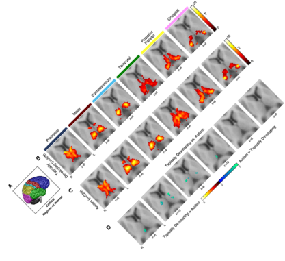
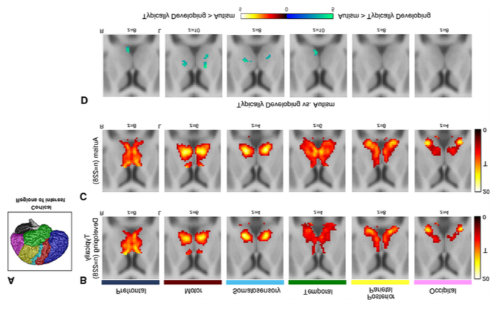
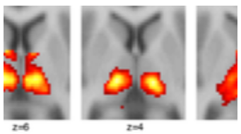

# Manipulating image files

## ImageMagick (linux, Mac)

### Installation

Go to the [ImageMagic installation page](https://imagemagick.org/script/download.php) for detailed instructions for different operating systems.

### Utilities

The following table presents a list of utilities that are part of ImageMagick and that can be used for different purposes. Each tool will have input and output options. Check [this section](#imagemagick-options) for a complete list of these options.

When specifying a color in any ImageMagick command, you can use the name of any [recognized color](#imagemagick-color-list), the RGB value, or the Hex value.

When specifying a shape to draw on an image, you can use any of the [valid shapes](#imagemagick-shapes).

| Utility | Use | Syntax | Links |
| --- | --- | --- | --- |
| `magick` | This command now replaces `convert`, which is deprecated. Change image format, blur, crop, draw on, flip, merge, resample, and more. Writes output on a new file. | `magick [input-options] input-file(s) [output-options] output-file` | [Man page](https://docs.oracle.com/cd/E88353_01/html/E37839/convert-1.html), [Documentation](https://imagemagick.org/script/convert.php) |
| `identify` | Obtain information about an image. | `identify [options] input-file` | [Man page](https://docs.oracle.com/cd/E88353_01/html/E37839/identify-1.html), [Documentation](http://imagemagick.org/script/identify.php) |
| `mogrify` | Resize an image, blur, crop, draw on, flip, merge, resample, and more. Re-writes original file. | `mogrify [options] input-file` | [Man page](https://docs.oracle.com/cd/E88353_01/html/E37839/mogrify-1.html), [Documentation](http://imagemagick.org/script/mogrify.php) |
| `composite` | Overlaps one image over another. | `composite  [  options ... ] change-file base-file [ mask-file ] output-image` | [Man page](https://docs.oracle.com/cd/E88353_01/html/E37839/composite-1.html), [Documentation](http://imagemagick.org/script/composite.php) |
| `montage` | Combines different images, adds border, frame, and much more. | `montage input-file[s] [options] output-file` | [Man page](https://docs.oracle.com/cd/E88353_01/html/E37839/montage-1.html), [Documentation](http://imagemagick.org/script/montage.php) |
| `compare` | Compare two images. | `compare input-file input-file [options] output-file` | [Man page](https://docs.oracle.com/cd/E88353_01/html/E37839/compare-1.html), [Documentation](http://imagemagick.org/script/compare.php) |
| `stream` | Writes the pixel components of an img a row at a time into different storage formats. | `compare input-file input-file [options] output-file` | [Man page](https://docs.oracle.com/cd/E88353_01/html/E37839/stream-1.html), [Documentation](http://imagemagick.org/script/stream.php) |
| `display` | Displays an image or image sequence. | `display [options] input-file` | [Man page](https://docs.oracle.com/cd/E88353_01/html/E37839/display-1.html), [Documentation](http://imagemagick.org/script/display.php) |
| `animate` | Animates an image sequence. | `animate [options] input-file` | [Man page](https://docs.oracle.com/cd/E88353_01/html/E37839/animate-1.html), [Documentation](http://imagemagick.org/script/animate.php) |
| `import` | Saves  any  visible  window as an img file. Captures a single window, the entire screen, or any rectangular portion of the screen. | `import [options] output-file` | [Man page](https://docs.oracle.com/cd/E88353_01/html/E37839/import-1.html), [Documentation](http://imagemagick.org/script/import.php) |
| `conjure` | Interprets and executes scripts written in the Magick Scripting Language (MSL). | `conjure [options] script.msl` | [Man page](https://docs.oracle.com/cd/E88353_01/html/E37839/conjure-1.html), [Documentation](http://imagemagick.org/script/conjure.php) |

### ImageMagick Format escapes

| Escape | Meaning |
| --- | --- |
| `%b` | File size (i.e. 123KB) |
| `%c` | Image class and colorspace |
| `%d` | Directory path of the image file |
| `%e` | File name extension |
| `%f` | File name |
| `%g` | Geometry: `<width>x<height>{+-}<xoffset>{+-}<yoffset>` |
| `%h` | Image height in pixels |
| `%m` | Image format (i.e. PNG) |
| `%Q` | Compression quality (for JPEG/PNG/MIFF) |
| `%r` | Image class only (DirectClass or PseudoClass) |
| `%t` | File name without extension |
| `%U` | Resolution unit (PixelsPerInch, PixelsPerCentimeter, or Undefined) |
| `%w` | Image width in pixels |
| `%x` | Horizontal resolution (pixels per unit). See `%U` for the unit. |
| `%y` | Vertical resolution (pixels per unit). See `%U` for the unit. |
| `%z` | Depth (bits per channel) |
| `%[channels]` | List of channels |
| `%[colorspace]` | Colorspace |
| `%[EXIF:tag]` | Image metadata. [This](#imagemagick-exif-tags) is the list of acceptable tags. If a tag is not available for the image, ImageMagick will print an empty string. |
| `%[fx:expression]` | Custom expression. This is a mathematical formula that can reference pixels, image dimensions, channels or constants. Please see the [ImageMagick expressions](#imagemagick-expressions) sections for more details. |
| `%[IPTC:tag]` | IPTC metadata (captions, keywords, etc.) |
| `%[mean]` | Mean pixel intensity |
| `%[profile:name]` | ICC/ICM or other image profile |
| `%[property:name]` | Image property (generic metadata) |
| `%[standard-deviation]` | Standard deviation of pixel intensity |

### ImageMagick expressions

ImageMagick expressions allow you to compute custom values using image properties.

Image properties that can be used in expressions:

- Basic image properties: `w` (image width in pixels), `h` (image height) in pixels, `u` (total number of pixels), `channels` (number of channels), `depth` (bits per channel), `colorspace`, `size`, `page.x` (x-offset of virtual canvas), `page.y` (y-offset of virtual canvas), `page.width` (width of virtual canvas), `page.height` (height of virtual canvas).
- Pixel values: `p{X,Y}.r` (red channel of pixel at X,Y), `p{X,Y}.g` (green channel of pixel at X,Y), `p{X,Y}.b` (blue channel of pixel at X,Y), `p{X,Y}.a` (alpha of pixel at X,Y).
- Arithmetic operators: `+`, `-`, `*`, `/`, `%` (modulus), `^` power, `()` (grouping).
- Logical operators: `<`, `>`, `<=`, `>=`, `==`, `!=`
- If/else expression: `%[fx:w>h ? "landscape" : "portrait"]` if weight is greater than height, prints `landscape`, else prints `portrait`.
- Functions: `abs(x)`, `sin(x)`, `cos(x)`, `tan(x)`, `log(x)`, `exp(x)`, `sqrt(x)`, `min(a,b)`, `max(a,b)`, `floor(x)`, `ceil(x)`.
- Channel statistics: `mean.r`, `mean.g`, `mean.b`, `standard_deviation.r`, `standard_deviation.g`, `standard_deviation.b`.

### ImageMagick EXIF tags

| EXIF Tag | Description |
| --- | --- |
| `DateTime` | Date and time of image modification |
| `DateTimeOriginal` | Original date and time the photo was taken |
| `DateTimeDigitized` | Date and time the image was digitized |
| `Make` | Camera manufacturer |
| `Model` | Camera model |
| `Software` | Software used to process the image |
| `ExposureTime` | Shutter speed |
| `FNumber` | Aperture (f-stop) |
| `ISOSpeedRatings` | ISO sensitivity |
| `ExposureProgram` | Exposure program used (e.g., Manual, Aperture priority) |
| `FocalLength` | Focal length of the lens |
| `MeteringMode` | Metering mode (how the camera measured light) |
| `Flash` | Flash status (on/off, fired, etc.) |
| `WhiteBalance` | White balance mode |
| `Orientation` | Image orientation (rotation) |
| `GPSLatitude` | Latitude where photo was taken |
| `GPSLongitude` | Longitude where photo was taken |
| `GPSAltitude` | Altitude where photo was taken |
| `ColorSpace` | Color space of the image |
| `ExifImageWidth` | Width recorded in EXIF (may differ from actual width) |
| `ExifImageHeight` | Height recorded in EXIF (may differ from actual height) |

### ImageMagick shapes

| Shape | Syntax | Notes |
| --- | --- | --- |
| Point | `point x,y` | Specified by an ordered pair of integer coordinates. |
| Line | `line x0,y0 x1,y1` | Requires a start and end point. |
| Rectangle | `rectangle x0,y0 x1,y1` | Specified by the pair of points at the upper left and lower right corners. |
| Round rectangle | `roundRectangle x0,y0, x1,y1 wc,hc` | Takes same corner points as `rectangle`, followed by the width and height of the rounded corners to be removed. |
| Arc | `arc x0,y0 x1,y1 a0,a1` | Requires two corners used to create a `rectangle`, followed by the start and end angles of the arc in degrees. |
| Ellipse | `ellipse x0,y0 rx,ry a0,a1` | Requires the center point, the horizontal and vertical radius, and the start and end angles in degrees. |
| Circle | `circle x0,y0 x1,y1` | Give the center and any point on the perimeter. Can make a disk (filled) or circle (unfilled). |
| Polyline | `polyline x0,y0 ... xn,yn` | Requires three or more points to define their perimeters. This is simply a polygon in which the final point is not stroked to the start point. |
| Polygon | `polygon x0,y0 ... xn,yn` | Requires three or more points to define their perimeters. |
| Bezier | `bezier x0,y0 ... xn,yn` | Creates a spline curve and requires three or points to define its shape. |
| Path | `path specification` | represents an outline of an object, defined in terms of `moveto` (set a new current point), `lineto` (draw a straight line), `curveto` (draw a Bezier curve), arc (elliptical or circular arc) and `closepath` (close the current shape by drawing a line to the last `moveto`) elements. |
| Image | `image operator x0,y0 w,h filename` | Used to composite an image with another image. |
| Text | `text x,y text_to_display` | Add text in coordinates x,y of image. |

### ImageMagick options

| Option | Arguments | Description | Category | `magick` | `identify` | `mogrify` | `composite` | `montage` | `compare` | `stream` | `display` | `animate` | `import` | `conjure` |
|--------|-----------|--------------|-----------|----------|-----------|-----------|-----------|----------|----------|----------|----------|----------|----------|
| `-adjoin` | No arguments | Join images into a single multi-image file  | bi-functional | no | no | true | no | true | true | no | no | no | true | no |
| `-affine` | `matrix` | affine transform matrix  | bi-functional | no | no | true | true | true | no | no | no | no | no | no |
| `-alpha` | `option` | activate, deactivate, reset, or set the alpha channel  | bi-functional | no | true | true | true | true | true | no | true | true | no | no |
| `-antialias` | `remove` | pixel-aliasing  | bi-functional | no | true | true | no | no | no | no | true | no | no | no |
| `-authenticate` | `password` |  | bi-functional | no | true | true | true | true | true | true | true | true | no | no |
| `-attenuate` | `factor` | lessen (or intensify) when adding noise to an image  | bi-functional | no | no | true | no | no | no | no | no | no | no | no |
| `-background` | `color` | background color  | bi-functional | no | no | true | no | no | true | no | no | no | no | no |
| `-bias` | `value` | add bias when convolving an image | input-option | no | no | true | no | no | no | no | no | no | no | no |
| `-black-point-compensation` | No arguments |  | bi-functional | no | no | true | no | no | no | no | no | no | no | no |
| `-blue-primary` | `point` | chromaticity blue primary point  | bi-functional | no | no | true | true | true | no | no | no | no | no | no |
| `-bordercolor` | `color` | border color | bi-functional | no | no | true | true | true | no | no | no | no | no | no |
| `-caption` | `string` | assign a caption to an image | bi-functional | no | no | true | no | true | no | no | no | no | no | no |
| `-clip` | No arguments | along the first path from the 8BIM profile  | input-option | no | true | true | no | no | no | no | true | no | no | no |
| `-clip-mask` | `filename` | associate a clip mask with the image  | input-option | no | true | true | no | no | no | no | no | no | no | no |
| `-clip-path` | `id` | clip along a named path from the 8BIM profile  | input-option | no | true | true | no | no | no | no | true | no | no | no |
| `-colorspace` | `type` | alternate image colorspace  | bi-functional | no | true | true | true | true | true | true | true | true | true | no |
| `-comment` | `string` | annotate image with comment  | bi-functional | no | no | true | true | true | no | no | true | no | true | no |
| `-compose` | `operator` | set image composite operator  | bi-functional | no | no | true | true | true | true | no | no | no | no | no |
| `-compress` | `type` | type of pixel compression when writing the image  | bi-functional | no | no | true | true | true | true | true | true | no | true | no |
| `-define` | `format:key=value` |  | output-option | no | true | true | true | true | true | true | true | true | true | no |
| `-delay` | `seconds` | display the next image after pausing  | bi-functional | no | no | true | no | true | no | no | true | true | true | no |
| `-density` | `geometry` | horizontal and vertical density of the image  | input-option | no | true | true | true | true | true | true | true | true | true | no |
| `-depth` | `value` | image depth  | bi-functional | no | true | true | true | true | true | true | true | true | true | no |
| `-direction` | `type` | render text right-to-left or left-to-right  | bi-functional | no | no | true | no | no | no | no | no | no | no | no |
| `-display` | `server` | get image or font from this X server  | bi-functional | no | no | true | true | true | no | no | true | true | true | no |
| `-dispose` | `method` | layer disposal method  | bi-functional | no | no | true | true | true | no | no | true | true | true | no |
| `-dither` | `method` | apply error diffusion to image  | bi-functional | no | no | true | true | true | no | no | true | true | true | no |
| `-encoding` | `type` | text encoding type  | bi-functional | no | no | true | true | true | no | no | no | no | true | no |
| `-endian` | `type` | endianness (MSB or LSB) of the image  | bi-functional | no | true | true | true | true | no | no | true | no | true | no |
| `-family` | `name` | render text with this font family  | bi-functional | no | no | true | no | true | no | no | no | no | no | no |
| `-features` | `distance` | analyze image features (e.g. contrast, correlation)  | bi-functional | no | true | true | no | no | no | no | no | no | no | no |
| `-fill` | `color` | color to use when filling a graphic primitive  | bi-functional | no | no | true | no | true | no | no | no | no | no | no |
| `-filter` | `type` | use this filter when resizing an image  | bi-functional | no | no | true | true | true | no | no | true | true | true | no |
| `-font` | `name` | render text with this font  | bi-functional | no | no | true | true | true | no | no | no | no | no | no |
| `-format` | `string` | output formatted image characteristics  | bi-functional | no | true | true | true | true | true | no | true | true | true | no |
| `-fuzz` | `distance` | colors within this distance are considered equal  | bi-functional | no | true | true | no | no | true | no | true | no | no | no |
| `-gravity` | `type` | horizontal and vertical text placement  | bi-functional | no | no | true | true | true | true | no | true | true | true | no |
| `-green-primary` | `point` | chromaticity green primary point  | bi-functional | no | no | true | true | true | no | no | no | no | no | no |
| `-illuminant` | `type` | reference illuminant  | bi-functional | no | no | true | no | no | no | no | no | no | no | no |
| `-intensity` | `method` | method to generate an intensity value from a pixel  | bi-functional | no | no | true | no | no | no | no | no | no | no | no |
| `-intent` | `type` | type of rendering intent when managing the image color  | bi-functional | no | no | true | no | no | no | no | no | no | no | no |
| `-interlace` | `type` | type of image interlacing scheme  | bi-functional | no | true | true | true | true | true | true | true | true | true | no |
| `-interline-spacing` | `value` |  | bi-functional | no | no | true | no | no | no | no | no | no | no | no |
| `-interpolate` | `method` | pixel color interpolation method | input-option | no | true | true | true | true | no | true | true | true | true | no |
| `-interword-spacing` | `value` |  | bi-functional | no | no | true | no | no | no | no | no | no | no | no |
| `-kerning` | `value` | set the space between two letters  | bi-functional | no | no | true | no | true | no | no | no | no | no | no |
| `-label` | `string` | assign a label to an image  | bi-functional | no | no | true | true | true | no | no | true | no | true | no |
| `-limit` | `type` | value pixel cache resource limit  | bi-functional | no | true | true | true | true | true | true | true | true | true | no |
| `-loop` | `iterations` | add Netscape loop extension to your GIF animation  | bi-functional | no | no | true | no | no | no | no | true | true | no | no |
| `-matte` | No arguments | matte channel if the image has one  | bi-functional | no | true | true | true | true | no | no | true | true | no | no |
| `-mattecolor` | `color` | frame color  | bi-functional | no | no | true | no | true | no | no | true | true | no | no |
| `-moments` | No arguments | image moments  | bi-functional | no | true | no | no | no | no | no | no | no | no | no |
| `-monitor` | No arguments | progress | input-option | no | true | true | true | true | true | true | true | true | true | true |
| `-orient` | `type` | image orientation  | bi-functional | no | no | true | no | no | no | no | no | no | no | no |
| `-page` | `geometry` | size and location of an image canvas (setting)  | input-option | no | no | true | true | true | no | no | true | true | true | no |
| `-ping` | No arguments | determine image attributes  | bi-functional | no | true | true | no | no | no | no | no | no | no | no |
| `-pointsize` | `value` | font point size  | bi-functional | no | no | true | true | true | no | no | no | no | true | no |
| `-precision` | `value` | maximum number of significant digits to print  | bi-functional | no | true | true | no | no | true | no | no | no | no | no |
| `-preview` | `type` | image preview type  | bi-functional | no | no | true | no | no | no | no | no | no | no | no |
| `-quality` | `value` | JPEG/MIFF/PNG compression level  | output-option | no | no | true | true | true | true | no | true | no | true | no |
| `-quiet` | No arguments | suppress all warning messages  | bi-functional | no | true | true | true | true | true | true | true | true | true | true |
| `-read-mask` | `filename` | associate a read mask with the image  | bi-functional | no | no | true | no | no | true | no | no | no | no | no |
| `-red-primary` | `point` | chromaticity red primary point  | bi-functional | no | no | true | true | true | no | no | no | no | no | no |
| `-regard-warnings` | No arguments | pay attention to warning messages  | bi-functional | no | true | true | true | true | true | true | true | true | true | true |
| `-remap` | `filename` | transform image colors to match this set of colors  | bi-functional | no | no | true | no | no | no | no | no | no | no | no |
| `-repage` | `geometry` | size and location of an image canvas  | input-option | no | no | true | true | true | true | no | true | true | true | no |
| `-respect-parentheses` | No arguments | settings remain in effect until parenthesis boundary  | bi-functional | no | true | true | true | true | true | true | true | true | true | no |
| `-sampling-factor` | `geometry` |  | bi-functional | no | true | true | true | true | true | true | true | true | true | no |
| `-scene` | `value` | image scene number  | bi-functional | no | no | true | true | no | no | no | no | no | true | no |
| `-seed` | `value` | seed a new sequence of pseudo-random numbers  | bi-functional | no | true | true | true | true | true | true | true | true | true | true |
| `-size` | `geometry` | width and height of image  | bi-functional | no | true | true | true | true | true | true | true | true | no | no |
| `-stretch` | `type` | render text with this font stretch  | bi-functional | no | no | true | no | no | no | no | no | no | no | no |
| `-stroke` | `color` | graphic primitive stroke color  | bi-functional | no | no | true | no | true | no | no | no | no | no | no |
| `-strokewidth` | `value` | graphic primitive stroke width  | bi-functional | no | no | true | no | no | no | no | no | no | no | no |
| `-style` | `type` | render text with this font style  | bi-functional | no | no | true | no | no | no | no | no | no | no | no |
| `-support` | `factor` | resize support: > 1.0 is blurry, < 1.0 is sharp  | bi-functional | no | no | no | true | true | no | no | true | true | true | no |
| `-synchronize` | `synchronize` | image to storage device  | bi-functional | no | no | true | true | true | true | true | no | no | true | no |
| `-taint` | No arguments | declare the image as modified  | bi-functional | no | no | true | true | true | true | true | no | no | true | no |
| `-texture` | `filename` | name of texture to tile onto the image background  | bi-functional | no | no | true | no | true | no | no | true | no | no | no |
| `-tile-offset` | `x,y` | Horizontal and vertical offset in pixels  | bi-functional | no | no | true | no | no | no | no | no | no | no | no |
| `-treedepth` | `value` | color tree depth  | bi-functional | no | no | true | true | true | no | no | true | true | true | no |
| `-transparent-color` | `color` | The color name or value that will be use as the transparent color | bi-functional | no | no | true | true | true | true | true | true | true | true | no |
| `-undercolor` | `color` | Highlight color that is drawn behind text  | bi-functional | no | no | true | no | no | no | no | no | no | no | no |
| `-units` | `type` | `type` can be `Undefined`, `PixelsPerInch` or `PixelsPerCentimeter` | bi-functional | no | true | true | true | true | no | no | no | no | no | no |
| `-verbose` | No arguments | print detailed information about the image  | bi-functional | no | true | true | true | true | true | true | true | true | true | true |
| `-view` | `WxH+X+Y` | Portion of the image to view or initial viewport | bi-functional (`W`: width, `H`: height, `X`: horizontal offset, `Y`: vertical offset) | no | no | true | no | no | no | no | no | no | no | no |
| `-virtual-pixel` | `method` | `method` used to generate pixels outside the image boundaries when performing distortions, transformations, or convolutions | bi-functional | no | true | true | true | true | true | true | true | true | true | no |
| `-weight` | `value` | render text with this font weight value | bi-functional | no | no | true | no | no | no | no | no | no | no | no |
| `-white-point` | `color` | color that represents the white reference for adjusting the image | bi-functional | no | no | true | true | true | no | no | no | no | no | no |
| `-write-mask` | `filename` | Path to the output file where the mask of the current image will be saved | bi-functional | no | no | no | no | no | true | no | no | no | no | no |
| `-adaptive-blur` | `radius{,sigma}` | `radius` of the blur in pixels, sigma is optional | bi-functional | no | no | true | no | no | no | no | no | no | no | no |
| `-adaptive-resize` | `geometry` | target size for the resized image (`widthxheight`, `width`, `height`) | bi-functional | no | no | true | no | no | no | no | no | no | no | no |
| `-adaptive-sharpen` | `radius{,sigma}` | `radius` determines the neighborhood size for the operation, sigma is optional | bi-functional | no | no | true | no | true | no | no | no | no | no | no |
| `-alpha` | `option` | on, activate, off, deactivate, set, opaque, copy  | bi-functional | no | true | true | true | true | true | no | true | true | no | no |
| `-annotate` | `geometry text` | `geometry`: `angle[xoffset][yoffset]`, `text`: string of text to draw on the image | bi-functional | no | no | true | no | true | no | no | no | no | true | no |
| `-auto-gamma` | No arguments | automagically adjust gamma level of image  | bi-functional | no | no | true | no | no | no | no | no | no | no | no |
| `-auto-level` | No arguments | automagically adjust color levels of image | bi-functional | no | no | true | no | no | no | no | true | no | no | no |
| `-auto-orient` | No arguments | automagically orient (rotate) image | bi-functional | no | true | true | no | true | true | no | true | no | no | no |
| `-auto-threshold` | `value` | `value` adjusts how aggressively the image is binarized, if omitted it's computed automatically | bi-functional | no | no | true | no | no | no | no | no | no | no | no |
| `-bench` | `filename` | measure performance | bi-functional | no | no | true | no | no | no | no | no | no | no | no |
| `-bilateral-blur` | `radius{,sigma}` | `radius` of the filter in pixels, sigma is optional | bi-functional | no | no | true | no | no | no | no | no | no | no | no |
| `-black-threshold` | `value` | pixels with intensity less than or equal to `value` are converted to black | bi-functional | no | no | true | no | no | no | no | no | no | no | no |
| `-blue-shift` | `factor` | simulate a scene at nighttime in the moonlight, higher `factor` values increase the effect | bi-functional | no | no | true | no | no | no | no | no | no | no | no |
| `-blur` | `radius{,sigma}` | reduce image noise and detail levels | bi-functional | no | no | true | no | true | no | no | no | no | no | no |
| `-border` | `width` or `widthxheight` | surround image with a border of color | bi-functional | no | no | true | true | true | no | no | true | no | true | no |
| `-bordercolor` | `color` | border color | bi-functional | no | no | true | true | true | no | no | no | no | no | no |
| `-brightness-contrast` | `brightness{,contrast}` | positive values for `brightness` increase it, negative decrease it, same for contrast, which is optional | bi-functional | no | no | true | no | no | true | no | no | no | no | no |
| `-canny` | geometry | detect edges in the image | bi-functional | no | no | true | no | no | no | no | no | no | no | no |
| `-cdl` | filename | color correct with a color decision list | bi-functional | no | no | true | no | no | no | no | no | no | no | no |
| `-channel` | mask | set the image channel mask | bi-functional | no | true | true | true | true | true | true | true | true | true | no |
| `-charcoal` | radius | simulate a charcoal drawing | bi-functional | no | no | true | no | no | no | no | no | no | no | no |
| `-chop` | geometry | remove pixels from the image interior | bi-functional | no | no | true | no | no | no | no | no | no | no | no |
| `-clahe` | geometry | contrast limited adaptive histogram equalization | bi-functional | no | no | true | no | no | no | no | no | no | no | no |
| `-clamp` | keep | pixel values in range (0-QuantumRange) | bi-functional | no | no | true | no | no | no | no | no | no | no | no |
| `-colorize` | value | colorize the image with the fill color | bi-functional | no | no | true | no | no | no | no | no | no | no | no |
| `-color-matrix` | matrix | apply color correction to the image | bi-functional | no | no | true | no | no | no | no | no | no | no | no |
| `-colors` | value | preferred number of colors in the image | bi-functional | no | no | true | true | true | no | no | true | true | true | no |
| `-connected-components` | connectivity |  | bi-functional | no | no | true | no | no | no | no | no | no | no | no |
| `-contrast` | enhance | or reduce the image contrast  | bi-functional | no | no | true | no | no | no | no | true | no | no | no |
| `-contrast-stretch` | geometry |  | bi-functional | no | no | true | no | no | no | no | no | no | no | no |
| `-convolve` | coefficients |  | bi-functional | no | no | true | no | no | no | no | no | no | no | no |
| `-cycle` | amount | cycle the image colormap  | bi-functional | no | no | true | no | no | no | no | no | no | no | no |
| `-decipher` | filename | convert cipher pixels to plain pixels  | bi-functional | no | no | true | true | no | true | no | true | true | no | no |
| `-deskew` | threshold | straighten an image  | bi-functional | no | no | true | no | no | no | no | true | no | no | no |
| `-despeckle` | reduce | the speckles within an image  | bi-functional | no | no | true | no | no | no | no | true | no | no | no |
| `-distort` | method | args  | bi-functional | no | no | true | true | true | true | no | no | no | no | no |
| `-draw` | string | annotate the image with a graphic primitive  | bi-functional | no | no | true | no | true | no | no | no | no | no | no |
| `-edge` | radius | apply a filter to detect edges in the image  | bi-functional | no | no | true | no | no | no | no | true | no | no | no |
| `-encipher` | filename | convert plain pixels to cipher pixels  | bi-functional | no | no | true | true | no | true | no | no | no | true | no |
| `-emboss` | radius | emboss an image  | bi-functional | no | no | true | no | no | no | no | no | no | no | no |
| `-enhance` | apply | a digital filter to enhance a noisy image  | bi-functional | no | no | true | no | no | no | no | true | no | no | no |
| `-equalize` | perform | histogram equalization to an image  | bi-functional | no | no | true | no | no | no | no | true | no | no | no |
| `-evaluate` | operator | value  | bi-functional | no | no | true | no | no | no | no | no | no | no | no |
| `-extent` | geometry | set the image size  | bi-functional | no | no | true | no | true | no | no | true | true | true | no |
| `-extract` | geometry | extract area from image  | bi-functional | no | true | true | true | true | true | true | true | true | no | no |
| `-fft` | implements | the discrete Fourier transform (DFT)  | bi-functional | no | no | true | no | no | no | no | no | no | no | no |
| `-flip` | flip | image vertically  | bi-functional | no | no | true | no | true | no | no | true | no | no | no |
| `-floodfill` | geometry | color  | bi-functional | no | no | true | no | no | no | no | no | no | no | no |
| `-flop` | flop | image horizontally  | bi-functional | no | no | true | no | true | no | no | true | no | no | no |
| `-frame` | geometry | surround image with an ornamental border  | bi-functional | no | no | true | no | true | no | no | true | no | true | no |
| `-function` | name | parameters  | bi-functional | no | no | true | no | no | no | no | no | no | no | no |
| `-gamma` | value | level of gamma correction  | bi-functional | no | true | true | no | true | no | no | true | true | no | no |
| `-gaussian-blur` | geometry |  | bi-functional | no | no | true | no | no | no | no | no | no | no | no |
| `-geometry` | geometry | preferred size or location of the image  | bi-functional | no | no | true | true | true | no | no | true | true | true | no |
| `-grayscale` | method | convert image to grayscale  | bi-functional | no | true | true | no | no | no | no | no | no | no | no |
| `-hough-lines` | geometry |  | bi-functional | no | no | true | no | no | no | no | no | no | no | no |
| `-identify` | identify | the format and characteristics of the image  | bi-functional | no | no | true | true | true | true | true | true | true | true | no |
| `-ift` | implements | the inverse discrete Fourier transform (DFT)  | bi-functional | no | no | true | no | no | no | no | no | no | no | no |
| `-implode` | amount | implode image pixels about the center  | bi-functional | no | no | true | no | no | no | no | no | no | no | no |
| `-integral` | calculate | the sum of values (pixel values) in the image  | bi-functional | no | no | true | no | no | no | no | no | no | no | no |
| `-interpolative-resize` | geometry |  | bi-functional | no | no | true | no | no | no | no | no | no | no | no |
| `-kmeans` | geometry | K means color reduction  | bi-functional | no | no | true | no | no | no | no | no | no | no | no |
| `-kuwahara` | geometry | edge preserving noise reduction filter  | bi-functional | no | no | true | no | no | no | no | no | no | no | no |
| `-lat` | geometry | local adaptive thresholding  | bi-functional | no | no | true | no | no | no | no | no | no | no | no |
| `-level` | value | adjust the level of image contrast  | bi-functional | no | no | true | no | no | true | no | no | no | no | no |
| `-level-colors` | color,color |  | bi-functional | no | no | true | no | no | no | no | no | no | no | no |
| `-linear-stretch` | geometry |  | bi-functional | no | no | true | no | no | no | no | no | no | no | no |
| `-liquid-rescale` | geometry |  | bi-functional | no | no | true | no | no | no | no | no | no | no | no |
| `-local-contrast` | geometry |  | bi-functional | no | no | true | no | no | no | no | no | no | no | no |
| `-mean-shift` | geometry | delineate arbitrarily shaped clusters in the image  | bi-functional | no | no | true | no | no | no | no | no | no | no | no |
| `-median` | geometry | apply a median filter to the image  | bi-functional | no | no | true | no | no | no | no | no | no | no | no |
| `-mode` | geometry | make each pixel the 'predominant color' of the  | bi-functional | no | no | true | no | true | no | no | no | no | no | no |
| `-modulate` | value | vary the brightness, saturation, and hue  | bi-functional | no | no | true | no | no | no | no | no | no | no | no |
| `-monochrome` | transform | image to black and white  | bi-functional | no | no | true | true | true | no | no | true | true | true | no |
| `-morphology` | method | kernel  | bi-functional | no | no | true | no | no | no | no | no | no | no | no |
| `-motion-blur` | geometry |  | bi-functional | no | no | true | no | no | no | no | no | no | no | no |
| `-negate` | replace | every pixel with its complementary color  | bi-functional | no | true | true | true | no | true | no | true | no | true | no |
| `-noise` | geometry | add or reduce noise in an image  | bi-functional | no | no | true | no | no | no | no | no | no | no | no |
| `-normalize` | transform | image to span the full range of colors  | bi-functional | no | no | true | no | no | no | no | true | no | no | no |
| `-opaque` | color | change this color to the fill color  | bi-functional | no | no | true | no | no | no | no | no | no | no | no |
| `-ordered-dither` | NxN |  | bi-functional | no | no | true | no | no | no | no | no | no | no | no |
| `-paint` | radius | simulate an oil painting  | bi-functional | no | no | true | no | no | no | no | no | no | no | no |
| `-perceptible` | epsilon |  | bi-functional | no | no | true | no | no | no | no | no | no | no | no |
| `-epsilon` |  |  | bi-functional | no | no | true | no | no | no | no | no | no | no | no |
| `-polaroid` | angle | simulate a Polaroid picture  | bi-functional | no | no | true | no | true | no | no | no | no | no | no |
| `-posterize` | levels | reduce the image to a limited number of color levels  | bi-functional | no | no | true | no | no | no | no | no | no | no | no |
| `-profile` | filename | add, delete, or apply an image profile  | bi-functional | no | no | true | true | true | true | no | true | no | no | no |
| `-quantize` | colorspace | reduce colors in this colorspace  | bi-functional | no | no | true | true | true | true | true | true | true | true | no |
| `-raise` | value | lighten/darken image edges to create a 3-D effect  | bi-functional | no | no | true | no | no | no | no | true | no | no | no |
| `-random-threshold` | low,high |  | bi-functional | no | no | true | no | no | no | no | no | no | no | no |
| `-range-threshold` | values |  | bi-functional | no | no | true | no | no | no | no | no | no | no | no |
| `-region` | geometry | apply options to a portion of the image  | bi-functional | no | no | true | no | no | no | no | no | no | no | no |
| `-render` | render | vector graphics  | bi-functional | no | no | true | no | no | no | no | no | no | no | no |
| `-resample` | geometry | change the resolution of an image  | bi-functional | no | no | true | no | no | no | no | true | true | no | no |
| `-reshape` | geometry | reshape the image  | bi-functional | no | no | true | no | no | no | no | no | no | no | no |
| `-resize` | geometry | resize the image  | bi-functional | no | no | true | true | true | true | no | true | true | true | no |
| `-roll` | geometry | roll an image vertically or horizontally  | bi-functional | no | no | true | no | no | no | no | true | no | no | no |
| `-rotate` | degrees | apply Paeth rotation to the image  | bi-functional | no | no | true | true | true | true | no | true | true | true | no |
| `-rotational-blur` | angle |  | bi-functional | no | no | true | no | no | no | no | no | no | no | no |
| `-sample` | geometry | scale image with pixel sampling  | bi-functional | no | no | true | no | no | no | no | true | no | no | no |
| `-scale` | geometry | scale the image  | bi-functional | no | no | true | no | true | no | no | no | no | no | no |
| `-segment` | values | segment an image  | bi-functional | no | no | true | no | no | no | no | true | no | no | no |
| `-selective-blur` | geometry |  | bi-functional | no | no | true | no | no | no | no | no | no | no | no |
| `-sepia-tone` | threshold |  | bi-functional | no | no | true | no | no | no | no | no | no | no | no |
| `-set` | property | value set an image property  | bi-functional | no | true | true | no | true | true | true | true | true | true | no |
| `-shade` | degrees | shade the image using a distant light source  | bi-functional | no | no | true | no | no | no | no | no | no | no | no |
| `-shadow` | geometry | simulate an image shadow  | bi-functional | no | no | true | no | true | no | no | no | no | no | no |
| `-sharpen` | geometry | sharpen the image  | bi-functional | no | no | true | true | no | no | no | true | no | no | no |
| `-shave` | geometry | shave pixels from the image edges  | bi-functional | no | no | true | true | no | no | no | no | no | no | no |
| `-shear` | geometry | slide one edge of the image along the X or Y axis  | bi-functional | no | no | true | no | no | no | no | no | no | no | no |
| `-sigmoidal-contrast` | geometry |  | bi-functional | no | no | true | no | no | true | no | no | no | no | no |
| `-sketch` | geometry | simulate a pencil sketch  | bi-functional | no | no | true | no | no | no | no | no | no | no | no |
| `-solarize` | threshold | negate all pixels above the threshold level  | bi-functional | no | no | true | no | no | no | no | no | no | no | no |
| `-sort-pixels` | sort | each scanline in ascending order of intensity  | bi-functional | no | no | true | no | no | no | no | no | no | no | no |
| `-sparse-color` | method | args  | bi-functional | no | no | true | no | no | no | no | no | no | no | no |
| `-splice` | geometry | splice the background color into the image  | bi-functional | no | no | true | no | no | no | no | no | no | no | no |
| `-spread` | radius | displace image pixels by a random amount  | bi-functional | no | no | true | no | no | no | no | no | no | no | no |
| `-statistic` | type | geometry  | bi-functional | no | no | true | no | no | no | no | no | no | no | no |
| `-strip` | strip | image of all profiles and comments  | output-option | no | true | true | true | true | no | no | true | true | true | no |
| `-swirl` | degrees | swirl image pixels about the center  | bi-functional | no | no | true | no | no | no | no | no | no | no | no |
| `-threshold` | value | threshold the image  | bi-functional | no | no | true | no | no | no | no | true | no | no | no |
| `-thumbnail` | geometry | create a thumbnail of the image  | bi-functional | no | no | true | true | true | no | no | true | true | true | no |
| `-tile` | filename | tile image when filling a graphic primitive  | bi-functional | no | no | true | true | true | no | no | no | no | no | no |
| `-tint` | value | tint the image with the fill color  | bi-functional | no | no | true | no | no | no | no | no | no | no | no |
| `-transform` | affine | transform image  | bi-functional | no | no | true | true | true | no | no | no | no | no | no |
| `-transparent` | color | make this color transparent within the image  | bi-functional | no | no | true | true | true | true | true | true | true | true | no |
| `-transpose` | flip | image vertically and rotate 90 degrees  | bi-functional | no | no | true | no | true | no | no | no | no | no | no |
| `-transverse` | flop | image horizontally and rotate 270 degrees  | bi-functional | no | no | true | no | no | no | no | no | no | no | no |
| `-trim` | trim | image edges  | bi-functional | no | no | true | no | true | true | no | true | true | true | no |
| `-type` | type | image type  | bi-functional | no | no | true | true | true | true | no | no | no | true | no |
| `-unique-colors` | discard | all but one of any pixel color  | bi-functional | no | no | true | no | no | no | no | no | no | no | no |
| `-unsharp` | geometry | sharpen the image  | bi-functional | no | no | true | true | true | no | no | no | no | no | no |
| `-vignette` | geometry | soften the edges of the image in vignette style  | bi-functional | no | no | true | no | no | no | no | no | no | no | no |
| `-wave` | geometry | alter an image along a sine wave  | bi-functional | no | no | true | no | no | no | no | no | no | no | no |
| `-wavelet-denoise` | threshold |  | bi-functional | no | no | true | no | no | no | no | no | no | no | no |
| `-white-balance` | automagically | adjust white balance of image  | bi-functional | no | no | true | no | no | no | no | no | no | no | no |
| `-white-threshold` | value |  | bi-functional | no | no | true | no | no | no | no | no | no | no | no |
| `-channel-fx` | expression |  | bi-functional | no | no | true | no | no | no | no | no | no | no | no |
| `-separate` | separate | an image channel into a grayscale image  | bi-functional | no | no | true | no | no | true | no | no | no | no | no |
| `-append` | append | an image sequence  | bi-functional | no | no | true | no | no | no | no | no | no | no | no |
| `-clut` | apply | a color lookup table to the image  | bi-functional | no | no | true | no | no | no | no | no | no | no | no |
| `-coalesce` | merge | a sequence of images  | bi-functional | no | no | true | no | true | no | no | true | true | no | no |
| `-combine` | combine | a sequence of images  | bi-functional | no | no | true | no | no | no | no | no | no | no | no |
| `-compare` | mathematically | and visually annotate the difference between an image and its reconstruction  | bi-functional | no | no | true | no | no | no | no | no | no | no | no |
| `-complex` | operator | perform complex mathematics on an image sequence  | bi-functional | no | no | true | no | no | no | no | no | no | no | no |
| `-composite` | composite | image  | bi-functional | no | no | true | no | true | no | no | no | no | no | no |
| `-copy` | geometry | offset  | bi-functional | no | no | true | no | no | no | no | no | no | no | no |
| `-crop` | geometry | cut out a rectangular region of the image  | input-option | no | true | true | no | true | true | no | true | true | true | no |
| `-deconstruct` | break | down an image sequence into constituent parts  | bi-functional | no | no | true | no | no | no | no | no | no | no | no |
| `-evaluate-sequence` | operator |  | bi-functional | no | no | true | no | no | no | no | no | no | no | no |
| `-flatten` | flatten | a sequence of images  | bi-functional | no | no | true | no | true | no | no | true | true | no | no |
| `-fx` | expression | apply mathematical expression to an image channel(s)  | bi-functional | no | no | true | no | no | no | no | no | no | no | no |
| `-hald-clut` | apply | a Hald color lookup table to the image  | bi-functional | no | no | true | no | no | no | no | no | no | no | no |
| `-layers` | method | optimize, merge, or compare image layers  | bi-functional | no | no | true | no | true | no | no | no | no | no | no |
| `-morph` | value | morph an image sequence  | bi-functional | no | no | true | no | no | no | no | no | no | no | no |
| `-mosaic` | create | a mosaic from an image sequence  | bi-functional | no | no | true | no | no | no | no | no | no | no | no |
| `-poly` | terms | build a polynomial from the image sequence and the corresponding  | bi-functional | no | no | true | no | no | no | no | no | no | no | no |
| `-print` | string | interpret string and print to console  | bi-functional | no | no | true | no | no | no | no | no | no | no | no |
| `-process` | arguments | process the image with a custom image filter  | bi-functional | no | no | true | no | no | no | no | no | no | no | no |
| `-smush` | geometry | smush an image sequence together  | bi-functional | no | no | true | no | no | no | no | no | no | no | no |
| `-write` | filename | write images to this file  | bi-functional | no | no | true | true | no | true | no | true | no | no | no |
| `-clone` | indexes | clone an image  | bi-functional | no | no | no | no | true | no | no | no | no | no | no |
| `-delete` | indexes | delete the image from the image sequence  | bi-functional | no | no | true | no | true | true | no | no | no | no | no |
| `-duplicate` | count,indexes |  | bi-functional | no | no | true | no | true | no | no | no | no | no | no |
| `-insert` | index | insert last image into the image sequence  | bi-functional | no | no | true | no | true | no | no | no | no | no | no |
| `-reverse` | reverse | image sequence  | bi-functional | no | no | true | no | true | no | no | no | no | no | no |
| `-swap` | indexes | swap two images in the image sequence  | bi-functional | no | no | true | true | true | no | no | no | no | no | no |
| `-debug` | events | display copious debugging information  | bi-functional | no | true | true | true | true | true | true | true | true | true | true |
| `-distribute-cache` | port |  | bi-functional | no | no | true | no | no | no | no | no | no | no | no |
| `-help` | print | program options  | bi-functional | no | true | true | true | true | true | true | true | true | true | true |
| `-list` | type | print a list of supported option arguments  | bi-functional | no | true | true | true | true | true | true | true | true | true | true |
| `-log` | format | format of debugging information  | bi-functional | no | true | true | true | true | true | true | true | true | true | true |
| `-usage` | print | program usage | bi-functional | no | no | no | no | no | no | no | no | no | no | no |
| `-version` | print | version information | bi-functional | no | true | true | true | true | true | true | true | true | true | true |

### ImageMagick color list

| Color name | RGB | Hex | Sample |
| --- | --- | --- | --- |
| White | rgb(255,255,255) | #FFFFFF | <font style="background-color: #FFFFFF;">#FFFFFF</font> |
| GhostWhite | rgb(248,248,255) | #F8F8FF | <font style="background-color: #F8F8FF;">#F8F8FF</font> |
| WhiteSmoke | rgb(245,245,245) | #F5F5F5 | <font style="background-color: #F5F5F5;">#F5F5F5</font> |
| Snow1 | rgb(255,250,250) | #FFFAFA | <font style="background-color: #FFFAFA;">#FFFAFA</font> |
| Snow2 | rgb(238,233,233) | #EEE9E9 | <font style="background-color: #EEE9E9;">#EEE9E9</font> |
| Snow3 | rgb(205,201,201) | #CDC9C9 | <font style="background-color: #CDC9C9;">#CDC9C9</font> |
| Snow4 | rgb(139,137,137) | #8B8989 | <font style="background-color: #8B8989;">#8B8989</font> |
| RosyBrown1 | rgb(255,193,193) | #FFC1C1 | <font style="background-color: #FFC1C1;">#FFC1C1</font> |
| RosyBrown2 | rgb(238,180,180) | #EEB4B4 | <font style="background-color: #EEB4B4;">#EEB4B4</font> |
| RosyBrown3 | rgb(205,155,155) | #CD9B9B | <font style="background-color: #CD9B9B;">#CD9B9B</font> |
| RosyBrown4 | rgb(139,105,105) | #8B6969 | <font style="background-color: #8B6969;">#8B6969</font> |
| RosyBrown | rgb(188,143,143) | #BC8F8F | <font style="background-color: #BC8F8F;">#BC8F8F</font> |
| LightCoral | rgb(240,128,128) | #F08080 | <font style="background-color: #F08080;">#F08080</font> |
| IndianRed | rgb(205,92,92) | #CD5C5C | <font style="background-color: #CD5C5C;">#CD5C5C</font> |
| IndianRed1 | rgb(255,106,106) | #FF6A6A | <font style="background-color: #FF6A6A;">#FF6A6A</font> |
| IndianRed2 | rgb(238,99,99) | #EE6363 | <font style="background-color: #EE6363;">#EE6363</font> |
| IndianRed3 | rgb(205,85,85) | #CD5555 | <font style="background-color: #CD5555;">#CD5555</font> |
| IndianRed4 | rgb(139,58,58) | #8B3A3A | <font style="background-color: #8B3A3A;">#8B3A3A</font> |
| Brown1 | rgb(255,64,64) | #FF4040 | <font style="background-color: #FF4040;">#FF4040</font> |
| Brown2 | rgb(238,59,59) | #EE3B3B | <font style="background-color: #EE3B3B;">#EE3B3B</font> |
| Brown3 | rgb(205,51,51) | #CD3333 | <font style="background-color: #CD3333;">#CD3333</font> |
| Brown4 | rgb(139,35,35) | #8B2323 | <font style="background-color: #8B2323;">#8B2323</font> |
| Brown | rgb(165,42,42) | #A52A2A | <font style="background-color: #A52A2A;">#A52A2A</font> |
| Firebrick1 | rgb(255,48,48) | #FF3030 | <font style="background-color: #FF3030;">#FF3030</font> |
| Firebrick2 | rgb(238,44,44) | #EE2C2C | <font style="background-color: #EE2C2C;">#EE2C2C</font> |
| Firebrick3 | rgb(205,38,38) | #CD2626 | <font style="background-color: #CD2626;">#CD2626</font> |
| Firebrick4 | rgb(139,26,26) | #8B1A1A | <font style="background-color: #8B1A1A;">#8B1A1A</font> |
| Firebrick | rgb(178,34,34) | #B22222 | <font style="background-color: #B22222;">#B22222</font> |
| Crimson | rgb(220,20,60) | #DC143C | <font style="background-color: #DC143C;">#DC143C</font> |
| Red1 | rgb(255,0,0) | #FF0000 | <font style="background-color: #FF0000;">#FF0000</font> |
| Red2 | rgb(238,0,0) | #EE0000 | <font style="background-color: #EE0000;">#EE0000</font> |
| Red3 | rgb(205,0,0) | #CD0000 | <font style="background-color: #CD0000;">#CD0000</font> |
| Red4 | rgb(139,0,0) | #8B0000 | <font style="background-color: #8B0000;">#8B0000</font> |
| DarkRed | rgb(139,0,0) | #8B0000 | <font style="background-color: #8B0000;">#8B0000</font> |
| Maroon(SVGcompliance) | rgb(128,0,0) | #800000 | <font style="background-color: #800000;">#800000</font> |
| LightPink | rgb(255,182,193) | #FFB6C1 | <font style="background-color: #FFB6C1;">#FFB6C1</font> |
| LightPink1 | rgb(255,174,185) | #FFAEB9 | <font style="background-color: #FFAEB9;">#FFAEB9</font> |
| LightPink2 | rgb(238,162,173) | #EEA2AD | <font style="background-color: #EEA2AD;">#EEA2AD</font> |
| LightPink3 | rgb(205,140,149) | #CD8C95 | <font style="background-color: #CD8C95;">#CD8C95</font> |
| LightPink4 | rgb(139,95,101) | #8B5F65 | <font style="background-color: #8B5F65;">#8B5F65</font> |
| Pink | rgb(255,192,203) | #FFC0CB | <font style="background-color: #FFC0CB;">#FFC0CB</font> |
| Pink1 | rgb(255,181,197) | #FFB5C5 | <font style="background-color: #FFB5C5;">#FFB5C5</font> |
| Pink2 | rgb(238,169,184) | #EEA9B8 | <font style="background-color: #EEA9B8;">#EEA9B8</font> |
| Pink3 | rgb(205,145,158) | #CD919E | <font style="background-color: #CD919E;">#CD919E</font> |
| Pink4 | rgb(139,99,108) | #8B636C | <font style="background-color: #8B636C;">#8B636C</font> |
| PaleVioletRed | rgb(219,112,147) | #DB7093 | <font style="background-color: #DB7093;">#DB7093</font> |
| PaleVioletRed1 | rgb(255,130,171) | #FF82AB | <font style="background-color: #FF82AB;">#FF82AB</font> |
| PaleVioletRed2 | rgb(238,121,159) | #EE799F | <font style="background-color: #EE799F;">#EE799F</font> |
| PaleVioletRed3 | rgb(205,104,137) | #CD6889 | <font style="background-color: #CD6889;">#CD6889</font> |
| PaleVioletRed4 | rgb(139,71,93) | #8B475D | <font style="background-color: #8B475D;">#8B475D</font> |
| Lavender | rgb(230,230,250) | #E6E6FA | <font style="background-color: #E6E6FA;">#E6E6FA</font> |
| LavenderBlush1 | rgb(255,240,245) | #FFF0F5 | <font style="background-color: #FFF0F5;">#FFF0F5</font> |
| LavenderBlush2 | rgb(238,224,229) | #EEE0E5 | <font style="background-color: #EEE0E5;">#EEE0E5</font> |
| LavenderBlush3 | rgb(205,193,197) | #CDC1C5 | <font style="background-color: #CDC1C5;">#CDC1C5</font> |
| LavenderBlush4 | rgb(139,131,134) | #8B8386 | <font style="background-color: #8B8386;">#8B8386</font> |
| Violet | rgb(238,130,238) | #EE82EE | <font style="background-color: #EE82EE;">#EE82EE</font> |
| VioletRed | rgb(208,32,144) | #D02090 | <font style="background-color: #D02090;">#D02090</font> |
| VioletRed1 | rgb(255,62,150) | #FF3E96 | <font style="background-color: #FF3E96;">#FF3E96</font> |
| VioletRed2 | rgb(238,58,140) | #EE3A8C | <font style="background-color: #EE3A8C;">#EE3A8C</font> |
| VioletRed3 | rgb(205,50,120) | #CD3278 | <font style="background-color: #CD3278;">#CD3278</font> |
| VioletRed4 | rgb(139,34,82) | #8B2252 | <font style="background-color: #8B2252;">#8B2252</font> |
| MediumVioletRed | rgb(199,21,133) | #C71585 | <font style="background-color: #C71585;">#C71585</font> |
| HotPink1 | rgb(255,110,180) | #FF6EB4 | <font style="background-color: #FF6EB4;">#FF6EB4</font> |
| HotPink2 | rgb(238,106,167) | #EE6AA7 | <font style="background-color: #EE6AA7;">#EE6AA7</font> |
| HotPink3 | rgb(205,96,144) | #CD6090 | <font style="background-color: #CD6090;">#CD6090</font> |
| HotPink4 | rgb(139,58,98) | #8B3A62 | <font style="background-color: #8B3A62;">#8B3A62</font> |
| DeepPink1 | rgb(255,20,147) | #FF1493 | <font style="background-color: #FF1493;">#FF1493</font> |
| DeepPink2 | rgb(238,18,137) | #EE1289 | <font style="background-color: #EE1289;">#EE1289</font> |
| DeepPink3 | rgb(205,16,118) | #CD1076 | <font style="background-color: #CD1076;">#CD1076</font> |
| DeepPink4 | rgb(139,10,80) | #8B0A50 | <font style="background-color: #8B0A50;">#8B0A50</font> |
| Maroon1 | rgb(255,52,179) | #FF34B3 | <font style="background-color: #FF34B3;">#FF34B3</font> |
| Maroon2 | rgb(238,48,167) | #EE30A7 | <font style="background-color: #EE30A7;">#EE30A7</font> |
| Maroon3 | rgb(205,41,144) | #CD2990 | <font style="background-color: #CD2990;">#CD2990</font> |
| Maroon4 | rgb(139,28,98) | #8B1C62 | <font style="background-color: #8B1C62;">#8B1C62</font> |
| Maroon(X11compliance) | rgb(176,48,96) | #B03060 | <font style="background-color: #B03060;">#B03060</font> |
| Orchid | rgb(218,112,214) | #DA70D6 | <font style="background-color: #DA70D6;">#DA70D6</font> |
| Orchid1 | rgb(255,131,250) | #FF83FA | <font style="background-color: #FF83FA;">#FF83FA</font> |
| Orchid2 | rgb(238,122,233) | #EE7AE9 | <font style="background-color: #EE7AE9;">#EE7AE9</font> |
| Orchid3 | rgb(205,105,201) | #CD69C9 | <font style="background-color: #CD69C9;">#CD69C9</font> |
| Orchid4 | rgb(139,71,137) | #8B4789 | <font style="background-color: #8B4789;">#8B4789</font> |
| MediumOrchid | rgb(186,85,211) | #BA55D3 | <font style="background-color: #BA55D3;">#BA55D3</font> |
| MediumOrchid1 | rgb(224,102,255) | #E066FF | <font style="background-color: #E066FF;">#E066FF</font> |
| MediumOrchid2 | rgb(209,95,238) | #D15FEE | <font style="background-color: #D15FEE;">#D15FEE</font> |
| MediumOrchid3 | rgb(180,82,205) | #B452CD | <font style="background-color: #B452CD;">#B452CD</font> |
| MediumOrchid4 | rgb(122,55,139) | #7A378B | <font style="background-color: #7A378B;">#7A378B</font> |
| DarkOrchid | rgb(153,50,204) | #9932CC | <font style="background-color: #9932CC;">#9932CC</font> |
| DarkOrchid1 | rgb(191,62,255) | #BF3EFF | <font style="background-color: #BF3EFF;">#BF3EFF</font> |
| DarkOrchid2 | rgb(178,58,238) | #B23AEE | <font style="background-color: #B23AEE;">#B23AEE</font> |
| DarkOrchid3 | rgb(154,50,205) | #9A32CD | <font style="background-color: #9A32CD;">#9A32CD</font> |
| DarkOrchid4 | rgb(104,34,139) | #68228B | <font style="background-color: #68228B;">#68228B</font> |
| Plum | rgb(221,160,221) | #DDA0DD | <font style="background-color: #DDA0DD;">#DDA0DD</font> |
| Plum1 | rgb(255,187,255) | #FFBBFF | <font style="background-color: #FFBBFF;">#FFBBFF</font> |
| Plum2 | rgb(238,174,238) | #EEAEEE | <font style="background-color: #EEAEEE;">#EEAEEE</font> |
| Plum3 | rgb(205,150,205) | #CD96CD | <font style="background-color: #CD96CD;">#CD96CD</font> |
| Plum4 | rgb(139,102,139) | #8B668B | <font style="background-color: #8B668B;">#8B668B</font> |
| Thistle | rgb(216,191,216) | #D8BFD8 | <font style="background-color: #D8BFD8;">#D8BFD8</font> |
| Thistle1 | rgb(255,225,255) | #FFE1FF | <font style="background-color: #FFE1FF;">#FFE1FF</font> |
| Thistle2 | rgb(238,210,238) | #EED2EE | <font style="background-color: #EED2EE;">#EED2EE</font> |
| Thistle3 | rgb(205,181,205) | #CDB5CD | <font style="background-color: #CDB5CD;">#CDB5CD</font> |
| Thistle4 | rgb(139,123,139) | #8B7B8B | <font style="background-color: #8B7B8B;">#8B7B8B</font> |
| Magenta1 | rgb(255,0,255) | #FF00FF | <font style="background-color: #FF00FF;">#FF00FF</font> |
| Magenta2 | rgb(238,0,238) | #EE00EE | <font style="background-color: #EE00EE;">#EE00EE</font> |
| Magenta3 | rgb(205,0,205) | #CD00CD | <font style="background-color: #CD00CD;">#CD00CD</font> |
| Magenta4 | rgb(139,0,139) | #8B008B | <font style="background-color: #8B008B;">#8B008B</font> |
| DarkMagenta | rgb(139,0,139) | #8B008B | <font style="background-color: #8B008B;">#8B008B</font> |
| DarkViolet | rgb(148,0,211) | #9400D3 | <font style="background-color: #9400D3;">#9400D3</font> |
| BlueViolet | rgb(138,43,226) | #8A2BE2 | <font style="background-color: #8A2BE2;">#8A2BE2</font> |
| Indigo | rgb(75,0,130) | #4B0082 | <font style="background-color: #4B0082;">#4B0082</font> |
| Purple1 | rgb(155,48,255) | #9B30FF | <font style="background-color: #9B30FF;">#9B30FF</font> |
| Purple2 | rgb(145,44,238) | #912CEE | <font style="background-color: #912CEE;">#912CEE</font> |
| Purple3 | rgb(125,38,205) | #7D26CD | <font style="background-color: #7D26CD;">#7D26CD</font> |
| Purple4 | rgb(85,26,139) | #551A8B | <font style="background-color: #551A8B;">#551A8B</font> |
| Purple(X11compliance) | rgb(160,32,240) | #A020F0 | <font style="background-color: #A020F0;">#A020F0</font> |
| Purple(SVGcompliance) | rgb(128,0,128) | #800080 | <font style="background-color: #800080;">#800080</font> |
| MediumPurple | rgb(147,112,219) | #9370DB | <font style="background-color: #9370DB;">#9370DB</font> |
| MediumPurple1 | rgb(171,130,255) | #AB82FF | <font style="background-color: #AB82FF;">#AB82FF</font> |
| MediumPurple2 | rgb(159,121,238) | #9F79EE | <font style="background-color: #9F79EE;">#9F79EE</font> |
| MediumPurple3 | rgb(137,104,205) | #8968CD | <font style="background-color: #8968CD;">#8968CD</font> |
| MediumPurple4 | rgb(93,71,139) | #5D478B | <font style="background-color: #5D478B;">#5D478B</font> |
| LightSlateBlue | rgb(132,112,255) | #8470FF | <font style="background-color: #8470FF;">#8470FF</font> |
| MediumSlateBlue | rgb(123,104,238) | #7B68EE | <font style="background-color: #7B68EE;">#7B68EE</font> |
| DarkSlateBlue | rgb(72,61,139) | #483D8B | <font style="background-color: #483D8B;">#483D8B</font> |
| SlateBlue | rgb(106,90,205) | #6A5ACD | <font style="background-color: #6A5ACD;">#6A5ACD</font> |
| SlateBlue1 | rgb(131,111,255) | #836FFF | <font style="background-color: #836FFF;">#836FFF</font> |
| SlateBlue2 | rgb(122,103,238) | #7A67EE | <font style="background-color: #7A67EE;">#7A67EE</font> |
| SlateBlue3 | rgb(105,89,205) | #6959CD | <font style="background-color: #6959CD;">#6959CD</font> |
| SlateBlue4 | rgb(71,60,139) | #473C8B | <font style="background-color: #473C8B;">#473C8B</font> |
| Blue1 | rgb(0,0,255) | #0000FF | <font style="background-color: #0000FF;">#0000FF</font> |
| Blue2 | rgb(0,0,238) | #0000EE | <font style="background-color: #0000EE;">#0000EE</font> |
| Blue3 | rgb(0,0,205) | #0000CD | <font style="background-color: #0000CD;">#0000CD</font> |
| Blue4 | rgb(0,0,139) | #00008B | <font style="background-color: #00008B;">#00008B</font> |
| MediumBlue | rgb(0,0,205) | #0000CD | <font style="background-color: #0000CD;">#0000CD</font> |
| DarkBlue | rgb(0,0,139) | #00008B | <font style="background-color: #00008B;">#00008B</font> |
| MidnightBlue | rgb(25,25,112) | #191970 | <font style="background-color: #191970;">#191970</font> |
| NavyBlue | rgb(0,0,128) | #000080 | <font style="background-color: #000080;">#000080</font> |
| RoyalBlue | rgb(65,105,225) | #4169E1 | <font style="background-color: #4169E1;">#4169E1</font> |
| RoyalBlue1 | rgb(72,118,255) | #4876FF | <font style="background-color: #4876FF;">#4876FF</font> |
| RoyalBlue2 | rgb(67,110,238) | #436EEE | <font style="background-color: #436EEE;">#436EEE</font> |
| RoyalBlue3 | rgb(58,95,205) | #3A5FCD | <font style="background-color: #3A5FCD;">#3A5FCD</font> |
| RoyalBlue4 | rgb(39,64,139) | #27408B | <font style="background-color: #27408B;">#27408B</font> |
| CornflowerBlue | rgb(100,149,237) | #6495ED | <font style="background-color: #6495ED;">#6495ED</font> |
| DodgerBlue1 | rgb(30,144,255) | #1E90FF | <font style="background-color: #1E90FF;">#1E90FF</font> |
| DodgerBlue2 | rgb(28,134,238) | #1C86EE | <font style="background-color: #1C86EE;">#1C86EE</font> |
| DodgerBlue3 | rgb(24,116,205) | #1874CD | <font style="background-color: #1874CD;">#1874CD</font> |
| DodgerBlue4 | rgb(16,78,139) | #104E8B | <font style="background-color: #104E8B;">#104E8B</font> |
| SteelBlue | rgb(70,130,180) | #4682B4 | <font style="background-color: #4682B4;">#4682B4</font> |
| SteelBlue1 | rgb(99,184,255) | #63B8FF | <font style="background-color: #63B8FF;">#63B8FF</font> |
| SteelBlue2 | rgb(92,172,238) | #5CACEE | <font style="background-color: #5CACEE;">#5CACEE</font> |
| SteelBlue3 | rgb(79,148,205) | #4F94CD | <font style="background-color: #4F94CD;">#4F94CD</font> |
| SteelBlue4 | rgb(54,100,139) | #36648B | <font style="background-color: #36648B;">#36648B</font> |
| SkyBlue | rgb(135,206,235) | #87CEEB | <font style="background-color: #87CEEB;">#87CEEB</font> |
| SkyBlue1 | rgb(135,206,255) | #87CEFF | <font style="background-color: #87CEFF;">#87CEFF</font> |
| SkyBlue2 | rgb(126,192,238) | #7EC0EE | <font style="background-color: #7EC0EE;">#7EC0EE</font> |
| SkyBlue3 | rgb(108,166,205) | #6CA6CD | <font style="background-color: #6CA6CD;">#6CA6CD</font> |
| SkyBlue4 | rgb(74,112,139) | #4A708B | <font style="background-color: #4A708B;">#4A708B</font> |
| Azure4 | rgb(131,139,139) | #838B8B | <font style="background-color: #838B8B;">#838B8B</font> |
| Azure3 | rgb(193,205,205) | #C1CDCD | <font style="background-color: #C1CDCD;">#C1CDCD</font> |
| Azure2 | rgb(224,238,238) | #E0EEEE | <font style="background-color: #E0EEEE;">#E0EEEE</font> |
| Azure1 | rgb(240,255,255) | #F0FFFF | <font style="background-color: #F0FFFF;">#F0FFFF</font> |
| MintCream | rgb(245,255,250) | #F5FFFA | <font style="background-color: #F5FFFA;">#F5FFFA</font> |
| AliceBlue | rgb(240,248,255) | #F0F8FF | <font style="background-color: #F0F8FF;">#F0F8FF</font> |
| LightSteelBlue | rgb(176,196,222) | #B0C4DE | <font style="background-color: #B0C4DE;">#B0C4DE</font> |
| LightSteelBlue1 | rgb(202,225,255) | #CAE1FF | <font style="background-color: #CAE1FF;">#CAE1FF</font> |
| LightSteelBlue2 | rgb(188,210,238) | #BCD2EE | <font style="background-color: #BCD2EE;">#BCD2EE</font> |
| LightSteelBlue3 | rgb(162,181,205) | #A2B5CD | <font style="background-color: #A2B5CD;">#A2B5CD</font> |
| LightSteelBlue4 | rgb(110,123,139) | #6E7B8B | <font style="background-color: #6E7B8B;">#6E7B8B</font> |
| LightSlateGray | rgb(119,136,153) | #778899 | <font style="background-color: #778899;">#778899</font> |
| SlateGray | rgb(112,128,144) | #708090 | <font style="background-color: #708090;">#708090</font> |
| SlateGray4 | rgb(108,123,139) | #6C7B8B | <font style="background-color: #6C7B8B;">#6C7B8B</font> |
| SlateGray3 | rgb(159,182,205) | #9FB6CD | <font style="background-color: #9FB6CD;">#9FB6CD</font> |
| SlateGray2 | rgb(185,211,238) | #B9D3EE | <font style="background-color: #B9D3EE;">#B9D3EE</font> |
| SlateGray1 | rgb(198,226,255) | #C6E2FF | <font style="background-color: #C6E2FF;">#C6E2FF</font> |
| LightSkyBlue | rgb(135,206,250) | #87CEFA | <font style="background-color: #87CEFA;">#87CEFA</font> |
| LightSkyBlue1 | rgb(176,226,255) | #B0E2FF | <font style="background-color: #B0E2FF;">#B0E2FF</font> |
| LightSkyBlue2 | rgb(164,211,238) | #A4D3EE | <font style="background-color: #A4D3EE;">#A4D3EE</font> |
| LightSkyBlue3 | rgb(141,182,205) | #8DB6CD | <font style="background-color: #8DB6CD;">#8DB6CD</font> |
| LightSkyBlue4 | rgb(96,123,139) | #607B8B | <font style="background-color: #607B8B;">#607B8B</font> |
| DeepSkyBlue1 | rgb(0,191,255) | #00BFFF | <font style="background-color: #00BFFF;">#00BFFF</font> |
| DeepSkyBlue2 | rgb(0,178,238) | #00B2EE | <font style="background-color: #00B2EE;">#00B2EE</font> |
| DeepSkyBlue3 | rgb(0,154,205) | #009ACD | <font style="background-color: #009ACD;">#009ACD</font> |
| DeepSkyBlue4 | rgb(0,104,139) | #00688B | <font style="background-color: #00688B;">#00688B</font> |
| LightBlue | rgb(173,216,230) | #ADD8E6 | <font style="background-color: #ADD8E6;">#ADD8E6</font> |
| LightBlue1 | rgb(191,239,255) | #BFEFFF | <font style="background-color: #BFEFFF;">#BFEFFF</font> |
| LightBlue2 | rgb(178,223,238) | #B2DFEE | <font style="background-color: #B2DFEE;">#B2DFEE</font> |
| LightBlue3 | rgb(154,192,205) | #9AC0CD | <font style="background-color: #9AC0CD;">#9AC0CD</font> |
| LightBlue4 | rgb(104,131,139) | #68838B | <font style="background-color: #68838B;">#68838B</font> |
| PowderBlue | rgb(176,224,230) | #B0E0E6 | <font style="background-color: #B0E0E6;">#B0E0E6</font> |
| CadetBlue | rgb(95,158,160) | #5F9EA0 | <font style="background-color: #5F9EA0;">#5F9EA0</font> |
| CadetBlue1 | rgb(152,245,255) | #98F5FF | <font style="background-color: #98F5FF;">#98F5FF</font> |
| CadetBlue2 | rgb(142,229,238) | #8EE5EE | <font style="background-color: #8EE5EE;">#8EE5EE</font> |
| CadetBlue3 | rgb(122,197,205) | #7AC5CD | <font style="background-color: #7AC5CD;">#7AC5CD</font> |
| CadetBlue4 | rgb(83,134,139) | #53868B | <font style="background-color: #53868B;">#53868B</font> |
| LightCyan1 | rgb(224,255,255) | #E0FFFF | <font style="background-color: #E0FFFF;">#E0FFFF</font> |
| LightCyan2 | rgb(209,238,238) | #D1EEEE | <font style="background-color: #D1EEEE;">#D1EEEE</font> |
| LightCyan3 | rgb(180,205,205) | #B4CDCD | <font style="background-color: #B4CDCD;">#B4CDCD</font> |
| LightCyan4 | rgb(122,139,139) | #7A8B8B | <font style="background-color: #7A8B8B;">#7A8B8B</font> |
| PaleTurquoise | rgb(175,238,238) | #AFEEEE | <font style="background-color: #AFEEEE;">#AFEEEE</font> |
| PaleTurquoise1 | rgb(187,255,255) | #BBFFFF | <font style="background-color: #BBFFFF;">#BBFFFF</font> |
| PaleTurquoise2 | rgb(174,238,238) | #AEEEEE | <font style="background-color: #AEEEEE;">#AEEEEE</font> |
| PaleTurquoise3 | rgb(150,205,205) | #96CDCD | <font style="background-color: #96CDCD;">#96CDCD</font> |
| PaleTurquoise4 | rgb(102,139,139) | #668B8B | <font style="background-color: #668B8B;">#668B8B</font> |
| DarkSlateGray | rgb(47,79,79) | #2F4F4F | <font style="background-color: #2F4F4F;">#2F4F4F</font> |
| DarkSlateGray1 | rgb(151,255,255) | #97FFFF | <font style="background-color: #97FFFF;">#97FFFF</font> |
| DarkSlateGray2 | rgb(141,238,238) | #8DEEEE | <font style="background-color: #8DEEEE;">#8DEEEE</font> |
| DarkSlateGray3 | rgb(121,205,205) | #79CDCD | <font style="background-color: #79CDCD;">#79CDCD</font> |
| DarkSlateGray4 | rgb(82,139,139) | #528B8B | <font style="background-color: #528B8B;">#528B8B</font> |
| Turquoise | rgb(64,224,208) | #40E0D0 | <font style="background-color: #40E0D0;">#40E0D0</font> |
| Turquoise1 | rgb(0,245,255) | #00F5FF | <font style="background-color: #00F5FF;">#00F5FF</font> |
| Turquoise2 | rgb(0,229,238) | #00E5EE | <font style="background-color: #00E5EE;">#00E5EE</font> |
| Turquoise3 | rgb(0,197,205) | #00C5CD | <font style="background-color: #00C5CD;">#00C5CD</font> |
| Turquoise4 | rgb(0,134,139) | #00868B | <font style="background-color: #00868B;">#00868B</font> |
| MediumTurquoise | rgb(72,209,204) | #48D1CC | <font style="background-color: #48D1CC;">#48D1CC</font> |
| DarkTurquoise | rgb(0,206,209) | #00CED1 | <font style="background-color: #00CED1;">#00CED1</font> |
| Cyan1 | rgb(0,255,255) | #00FFFF | <font style="background-color: #00FFFF;">#00FFFF</font> |
| Cyan2 | rgb(0,238,238) | #00EEEE | <font style="background-color: #00EEEE;">#00EEEE</font> |
| Cyan3 | rgb(0,205,205) | #00CDCD | <font style="background-color: #00CDCD;">#00CDCD</font> |
| Cyan4 | rgb(0,139,139) | #008B8B | <font style="background-color: #008B8B;">#008B8B</font> |
| DarkCyan | rgb(0,139,139) | #008B8B | <font style="background-color: #008B8B;">#008B8B</font> |
| Teal | rgb(0,128,128) | #008080 | <font style="background-color: #008080;">#008080</font> |
| LightSeaGreen | rgb(32,178,170) | #20B2AA | <font style="background-color: #20B2AA;">#20B2AA</font> |
| Aquamarine1 | rgb(127,255,212) | #7FFFD4 | <font style="background-color: #7FFFD4;">#7FFFD4</font> |
| Aquamarine2 | rgb(118,238,198) | #76EEC6 | <font style="background-color: #76EEC6;">#76EEC6</font> |
| Aquamarine3 | rgb(102,205,170) | #66CDAA | <font style="background-color: #66CDAA;">#66CDAA</font> |
| Aquamarine4 | rgb(69,139,116) | #458B74 | <font style="background-color: #458B74;">#458B74</font> |
| MediumAquamarine | rgb(102,205,170) | #66CDAA | <font style="background-color: #66CDAA;">#66CDAA</font> |
| SpringGreen1 | rgb(0,255,127) | #00FF7F | <font style="background-color: #00FF7F;">#00FF7F</font> |
| SpringGreen2 | rgb(0,238,118) | #00EE76 | <font style="background-color: #00EE76;">#00EE76</font> |
| SpringGreen3 | rgb(0,205,102) | #00CD66 | <font style="background-color: #00CD66;">#00CD66</font> |
| SpringGreen4 | rgb(0,139,69) | #008B45 | <font style="background-color: #008B45;">#008B45</font> |
| MediumSpringGreen | rgb(0,250,154) | #00FA9A | <font style="background-color: #00FA9A;">#00FA9A</font> |
| SeaGreen | rgb(46,139,87) | #2E8B57 | <font style="background-color: #2E8B57;">#2E8B57</font> |
| SeaGreen1 | rgb(84,255,159) | #54FF9F | <font style="background-color: #54FF9F;">#54FF9F</font> |
| SeaGreen2 | rgb(78,238,148) | #4EEE94 | <font style="background-color: #4EEE94;">#4EEE94</font> |
| SeaGreen3 | rgb(67,205,128) | #43CD80 | <font style="background-color: #43CD80;">#43CD80</font> |
| SeaGreen4 | rgb(46,139,87) | #2E8B57 | <font style="background-color: #2E8B57;">#2E8B57</font> |
| MediumSeaGreen | rgb(60,179,113) | #3CB371 | <font style="background-color: #3CB371;">#3CB371</font> |
| DarkSeaGreen | rgb(143,188,143) | #8FBC8F | <font style="background-color: #8FBC8F;">#8FBC8F</font> |
| DarkSeaGreen1 | rgb(193,255,193) | #C1FFC1 | <font style="background-color: #C1FFC1;">#C1FFC1</font> |
| DarkSeaGreen2 | rgb(180,238,180) | #B4EEB4 | <font style="background-color: #B4EEB4;">#B4EEB4</font> |
| DarkSeaGreen3 | rgb(155,205,155) | #9BCD9B | <font style="background-color: #9BCD9B;">#9BCD9B</font> |
| DarkSeaGreen4 | rgb(105,139,105) | #698B69 | <font style="background-color: #698B69;">#698B69</font> |
| MediumForestGreen | rgb(50,129,75) | #32814B | <font style="background-color: #32814B;">#32814B</font> |
| Honeydew1 | rgb(240,255,240) | #F0FFF0 | <font style="background-color: #F0FFF0;">#F0FFF0</font> |
| Honeydew2 | rgb(224,238,224) | #E0EEE0 | <font style="background-color: #E0EEE0;">#E0EEE0</font> |
| Honeydew3 | rgb(193,205,193) | #C1CDC1 | <font style="background-color: #C1CDC1;">#C1CDC1</font> |
| Honeydew4 | rgb(131,139,131) | #838B83 | <font style="background-color: #838B83;">#838B83</font> |
| PaleGreen | rgb(152,251,152) | #98FB98 | <font style="background-color: #98FB98;">#98FB98</font> |
| PaleGreen1 | rgb(154,255,154) | #9AFF9A | <font style="background-color: #9AFF9A;">#9AFF9A</font> |
| PaleGreen2 | rgb(144,238,144) | #90EE90 | <font style="background-color: #90EE90;">#90EE90</font> |
| PaleGreen3 | rgb(124,205,124) | #7CCD7C | <font style="background-color: #7CCD7C;">#7CCD7C</font> |
| PaleGreen4 | rgb(84,139,84) | #548B54 | <font style="background-color: #548B54;">#548B54</font> |
| LightGreen | rgb(144,238,144) | #90EE90 | <font style="background-color: #90EE90;">#90EE90</font> |
| Green | rgb(0,128,0) | #008000 | <font style="background-color: #008000;">#008000</font> |
| Green1 | rgb(0,255,0) | #00FF00 | <font style="background-color: #00FF00;">#00FF00</font> |
| Green2 | rgb(0,238,0) | #00EE00 | <font style="background-color: #00EE00;">#00EE00</font> |
| Green3 | rgb(0,205,0) | #00CD00 | <font style="background-color: #00CD00;">#00CD00</font> |
| Green4 | rgb(0,139,0) | #008B00 | <font style="background-color: #008B00;">#008B00</font> |
| LimeGreen | rgb(50,205,50) | #32CD32 | <font style="background-color: #32CD32;">#32CD32</font> |
| ForestGreen | rgb(34,139,34) | #228B22 | <font style="background-color: #228B22;">#228B22</font> |
| DarkGreen | rgb(0,100,0) | #006400 | <font style="background-color: #006400;">#006400</font> |
| LawnGreen | rgb(124,252,0) | #7CFC00 | <font style="background-color: #7CFC00;">#7CFC00</font> |
| Chartreuse1 | rgb(127,255,0) | #7FFF00 | <font style="background-color: #7FFF00;">#7FFF00</font> |
| Chartreuse2 | rgb(118,238,0) | #76EE00 | <font style="background-color: #76EE00;">#76EE00</font> |
| Chartreuse3 | rgb(102,205,0) | #66CD00 | <font style="background-color: #66CD00;">#66CD00</font> |
| Chartreuse4 | rgb(69,139,0) | #458B00 | <font style="background-color: #458B00;">#458B00</font> |
| GreenYellow | rgb(173,255,47) | #ADFF2F | <font style="background-color: #ADFF2F;">#ADFF2F</font> |
| YellowGreen | rgb(154,205,50) | #9ACD32 | <font style="background-color: #9ACD32;">#9ACD32</font> |
| DarkOliveGreen | rgb(85,107,47) | #556B2F | <font style="background-color: #556B2F;">#556B2F</font> |
| DarkOliveGreen1 | rgb(202,255,112) | #CAFF70 | <font style="background-color: #CAFF70;">#CAFF70</font> |
| DarkOliveGreen2 | rgb(188,238,104) | #BCEE68 | <font style="background-color: #BCEE68;">#BCEE68</font> |
| DarkOliveGreen3 | rgb(162,205,90) | #A2CD5A | <font style="background-color: #A2CD5A;">#A2CD5A</font> |
| DarkOliveGreen4 | rgb(110,139,61) | #6E8B3D | <font style="background-color: #6E8B3D;">#6E8B3D</font> |
| OliveDrab | rgb(107,142,35) | #6B8E23 | <font style="background-color: #6B8E23;">#6B8E23</font> |
| OliveDrab1 | rgb(192,255,62) | #C0FF3E | <font style="background-color: #C0FF3E;">#C0FF3E</font> |
| OliveDrab2 | rgb(179,238,58) | #B3EE3A | <font style="background-color: #B3EE3A;">#B3EE3A</font> |
| OliveDrab3 | rgb(154,205,50) | #9ACD32 | <font style="background-color: #9ACD32;">#9ACD32</font> |
| OliveDrab4 | rgb(105,139,34) | #698B22 | <font style="background-color: #698B22;">#698B22</font> |
| Ivory1 | rgb(255,255,240) | #FFFFF0 | <font style="background-color: #FFFFF0;">#FFFFF0</font> |
| Ivory2 | rgb(238,238,224) | #EEEEE0 | <font style="background-color: #EEEEE0;">#EEEEE0</font> |
| Ivory3 | rgb(205,205,193) | #CDCDC1 | <font style="background-color: #CDCDC1;">#CDCDC1</font> |
| Ivory4 | rgb(139,139,131) | #8B8B83 | <font style="background-color: #8B8B83;">#8B8B83</font> |
| LightYellow1 | rgb(255,255,224) | #FFFFE0 | <font style="background-color: #FFFFE0;">#FFFFE0</font> |
| LightYellow2 | rgb(238,238,209) | #EEEED1 | <font style="background-color: #EEEED1;">#EEEED1</font> |
| LightYellow3 | rgb(205,205,180) | #CDCDB4 | <font style="background-color: #CDCDB4;">#CDCDB4</font> |
| LightYellow4 | rgb(139,139,122) | #8B8B7A | <font style="background-color: #8B8B7A;">#8B8B7A</font> |
| Beige | rgb(245,245,220) | #F5F5DC | <font style="background-color: #F5F5DC;">#F5F5DC</font> |
| LightGoldenrodYellow | rgb(250,250,210) | #FAFAD2 | <font style="background-color: #FAFAD2;">#FAFAD2</font> |
| Yellow1 | rgb(255,255,0) | #FFFF00 | <font style="background-color: #FFFF00;">#FFFF00</font> |
| Yellow2 | rgb(238,238,0) | #EEEE00 | <font style="background-color: #EEEE00;">#EEEE00</font> |
| Yellow3 | rgb(205,205,0) | #CDCD00 | <font style="background-color: #CDCD00;">#CDCD00</font> |
| Yellow4 | rgb(139,139,0) | #8B8B00 | <font style="background-color: #8B8B00;">#8B8B00</font> |
| Olive | rgb(128,128,0) | #808000 | <font style="background-color: #808000;">#808000</font> |
| Khaki | rgb(240,230,140) | #F0E68C | <font style="background-color: #F0E68C;">#F0E68C</font> |
| Khaki1 | rgb(255,246,143) | #FFF68F | <font style="background-color: #FFF68F;">#FFF68F</font> |
| Khaki2 | rgb(238,230,133) | #EEE685 | <font style="background-color: #EEE685;">#EEE685</font> |
| Khaki3 | rgb(205,198,115) | #CDC673 | <font style="background-color: #CDC673;">#CDC673</font> |
| Khaki4 | rgb(139,134,78) | #8B864E | <font style="background-color: #8B864E;">#8B864E</font> |
| DarkKhaki | rgb(189,183,107) | #BDB76B | <font style="background-color: #BDB76B;">#BDB76B</font> |
| LemonChiffon1 | rgb(255,250,205) | #FFFACD | <font style="background-color: #FFFACD;">#FFFACD</font> |
| LemonChiffon2 | rgb(238,233,191) | #EEE9BF | <font style="background-color: #EEE9BF;">#EEE9BF</font> |
| LemonChiffon3 | rgb(205,201,165) | #CDC9A5 | <font style="background-color: #CDC9A5;">#CDC9A5</font> |
| LemonChiffon4 | rgb(139,137,112) | #8B8970 | <font style="background-color: #8B8970;">#8B8970</font> |
| PaleGoldenrod | rgb(238,232,170) | #EEE8AA | <font style="background-color: #EEE8AA;">#EEE8AA</font> |
| MediumGoldenRod | rgb(209,193,102) | #D1C166 | <font style="background-color: #D1C166;">#D1C166</font> |
| Gold1 | rgb(255,215,0) | #FFD700 | <font style="background-color: #FFD700;">#FFD700</font> |
| Gold2 | rgb(238,201,0) | #EEC900 | <font style="background-color: #EEC900;">#EEC900</font> |
| Gold3 | rgb(205,173,0) | #CDAD00 | <font style="background-color: #CDAD00;">#CDAD00</font> |
| Gold4 | rgb(139,117,0) | #8B7500 | <font style="background-color: #8B7500;">#8B7500</font> |
| LightGoldenrod | rgb(238,221,130) | #EEDD82 | <font style="background-color: #EEDD82;">#EEDD82</font> |
| LightGoldenrod1 | rgb(255,236,139) | #FFEC8B | <font style="background-color: #FFEC8B;">#FFEC8B</font> |
| LightGoldenrod2 | rgb(238,220,130) | #EEDC82 | <font style="background-color: #EEDC82;">#EEDC82</font> |
| LightGoldenrod3 | rgb(205,190,112) | #CDBE70 | <font style="background-color: #CDBE70;">#CDBE70</font> |
| LightGoldenrod4 | rgb(139,129,76) | #8B814C | <font style="background-color: #8B814C;">#8B814C</font> |
| Cornsilk1 | rgb(255,248,220) | #FFF8DC | <font style="background-color: #FFF8DC;">#FFF8DC</font> |
| Cornsilk2 | rgb(238,232,205) | #EEE8CD | <font style="background-color: #EEE8CD;">#EEE8CD</font> |
| Cornsilk3 | rgb(205,200,177) | #CDC8B1 | <font style="background-color: #CDC8B1;">#CDC8B1</font> |
| Cornsilk4 | rgb(139,136,120) | #8B8878 | <font style="background-color: #8B8878;">#8B8878</font> |
| Goldenrod | rgb(218,165,32) | #DAA520 | <font style="background-color: #DAA520;">#DAA520</font> |
| Goldenrod1 | rgb(255,193,37) | #FFC125 | <font style="background-color: #FFC125;">#FFC125</font> |
| Goldenrod2 | rgb(238,180,34) | #EEB422 | <font style="background-color: #EEB422;">#EEB422</font> |
| Goldenrod3 | rgb(205,155,29) | #CD9B1D | <font style="background-color: #CD9B1D;">#CD9B1D</font> |
| Goldenrod4 | rgb(139,105,20) | #8B6914 | <font style="background-color: #8B6914;">#8B6914</font> |
| DarkGoldenrod | rgb(184,134,11) | #B8860B | <font style="background-color: #B8860B;">#B8860B</font> |
| DarkGoldenrod1 | rgb(255,185,15) | #FFB90F | <font style="background-color: #FFB90F;">#FFB90F</font> |
| DarkGoldenrod2 | rgb(238,173,14) | #EEAD0E | <font style="background-color: #EEAD0E;">#EEAD0E</font> |
| DarkGoldenrod3 | rgb(205,149,12) | #CD950C | <font style="background-color: #CD950C;">#CD950C</font> |
| DarkGoldenrod4 | rgb(139,101,8) | #8B6508 | <font style="background-color: #8B6508;">#8B6508</font> |
| FloralWhite | rgb(255,250,240) | #FFFAF0 | <font style="background-color: #FFFAF0;">#FFFAF0</font> |
| Wheat | rgb(245,222,179) | #F5DEB3 | <font style="background-color: #F5DEB3;">#F5DEB3</font> |
| Wheat1 | rgb(255,231,186) | #FFE7BA | <font style="background-color: #FFE7BA;">#FFE7BA</font> |
| Wheat2 | rgb(238,216,174) | #EED8AE | <font style="background-color: #EED8AE;">#EED8AE</font> |
| Wheat3 | rgb(205,186,150) | #CDBA96 | <font style="background-color: #CDBA96;">#CDBA96</font> |
| Wheat4 | rgb(139,126,102) | #8B7E66 | <font style="background-color: #8B7E66;">#8B7E66</font> |
| OldLace | rgb(253,245,230) | #FDF5E6 | <font style="background-color: #FDF5E6;">#FDF5E6</font> |
| Orange1 | rgb(255,165,0) | #FFA500 | <font style="background-color: #FFA500;">#FFA500</font> |
| Orange2 | rgb(238,154,0) | #EE9A00 | <font style="background-color: #EE9A00;">#EE9A00</font> |
| Orange3 | rgb(205,133,0) | #CD8500 | <font style="background-color: #CD8500;">#CD8500</font> |
| Orange4 | rgb(139,90,0) | #8B5A00 | <font style="background-color: #8B5A00;">#8B5A00</font> |
| Moccasin | rgb(255,228,181) | #FFE4B5 | <font style="background-color: #FFE4B5;">#FFE4B5</font> |
| PapayaWhip | rgb(255,239,213) | #FFEFD5 | <font style="background-color: #FFEFD5;">#FFEFD5</font> |
| BlanchedAlmond | rgb(255,235,205) | #FFEBCD | <font style="background-color: #FFEBCD;">#FFEBCD</font> |
| NavajoWhite1 | rgb(255,222,173) | #FFDEAD | <font style="background-color: #FFDEAD;">#FFDEAD</font> |
| NavajoWhite2 | rgb(238,207,161) | #EECFA1 | <font style="background-color: #EECFA1;">#EECFA1</font> |
| NavajoWhite3 | rgb(205,179,139) | #CDB38B | <font style="background-color: #CDB38B;">#CDB38B</font> |
| NavajoWhite4 | rgb(139,121,94) | #8B795E | <font style="background-color: #8B795E;">#8B795E</font> |
| AntiqueWhite | rgb(250,235,215) | #FAEBD7 | <font style="background-color: #FAEBD7;">#FAEBD7</font> |
| AntiqueWhite1 | rgb(255,239,219) | #FFEFDB | <font style="background-color: #FFEFDB;">#FFEFDB</font> |
| AntiqueWhite2 | rgb(238,223,204) | #EEDFCC | <font style="background-color: #EEDFCC;">#EEDFCC</font> |
| AntiqueWhite3 | rgb(205,192,176) | #CDC0B0 | <font style="background-color: #CDC0B0;">#CDC0B0</font> |
| AntiqueWhite4 | rgb(139,131,120) | #8B8378 | <font style="background-color: #8B8378;">#8B8378</font> |
| Bisque1 | rgb(255,228,196) | #FFE4C4 | <font style="background-color: #FFE4C4;">#FFE4C4</font> |
| Bisque2 | rgb(238,213,183) | #EED5B7 | <font style="background-color: #EED5B7;">#EED5B7</font> |
| Bisque3 | rgb(205,183,158) | #CDB79E | <font style="background-color: #CDB79E;">#CDB79E</font> |
| Bisque4 | rgb(139,125,107) | #8B7D6B | <font style="background-color: #8B7D6B;">#8B7D6B</font> |
| Burlywood | rgb(222,184,135) | #DEB887 | <font style="background-color: #DEB887;">#DEB887</font> |
| Burlywood1 | rgb(255,211,155) | #FFD39B | <font style="background-color: #FFD39B;">#FFD39B</font> |
| Burlywood2 | rgb(238,197,145) | #EEC591 | <font style="background-color: #EEC591;">#EEC591</font> |
| Burlywood3 | rgb(205,170,125) | #CDAA7D | <font style="background-color: #CDAA7D;">#CDAA7D</font> |
| Burlywood4 | rgb(139,115,85) | #8B7355 | <font style="background-color: #8B7355;">#8B7355</font> |
| DarkOrange | rgb(255,140,0) | #FF8C00 | <font style="background-color: #FF8C00;">#FF8C00</font> |
| DarkOrange1 | rgb(255,127,0) | #FF7F00 | <font style="background-color: #FF7F00;">#FF7F00</font> |
| DarkOrange2 | rgb(238,118,0) | #EE7600 | <font style="background-color: #EE7600;">#EE7600</font> |
| DarkOrange3 | rgb(205,102,0) | #CD6600 | <font style="background-color: #CD6600;">#CD6600</font> |
| DarkOrange4 | rgb(139,69,0) | #8B4500 | <font style="background-color: #8B4500;">#8B4500</font> |
| Linen | rgb(250,240,230) | #FAF0E6 | <font style="background-color: #FAF0E6;">#FAF0E6</font> |
| Peru | rgb(205,133,63) | #CD853F | <font style="background-color: #CD853F;">#CD853F</font> |
| Tan | rgb(210,180,140) | #D2B48C | <font style="background-color: #D2B48C;">#D2B48C</font> |
| Tan1 | rgb(255,165,79) | #FFA54F | <font style="background-color: #FFA54F;">#FFA54F</font> |
| Tan2 | rgb(238,154,73) | #EE9A49 | <font style="background-color: #EE9A49;">#EE9A49</font> |
| Tan3 | rgb(205,133,63) | #CD853F | <font style="background-color: #CD853F;">#CD853F</font> |
| Tan4 | rgb(139,90,43) | #8B5A2B | <font style="background-color: #8B5A2B;">#8B5A2B</font> |
| PeachPuff1 | rgb(255,218,185) | #FFDAB9 | <font style="background-color: #FFDAB9;">#FFDAB9</font> |
| PeachPuff2 | rgb(238,203,173) | #EECBAD | <font style="background-color: #EECBAD;">#EECBAD</font> |
| PeachPuff3 | rgb(205,175,149) | #CDAF95 | <font style="background-color: #CDAF95;">#CDAF95</font> |
| PeachPuff4 | rgb(139,119,101) | #8B7765 | <font style="background-color: #8B7765;">#8B7765</font> |
| SandyBrown | rgb(244,164,96) | #F4A460 | <font style="background-color: #F4A460;">#F4A460</font> |
| Seashell1 | rgb(255,245,238) | #FFF5EE | <font style="background-color: #FFF5EE;">#FFF5EE</font> |
| Seashell2 | rgb(238,229,222) | #EEE5DE | <font style="background-color: #EEE5DE;">#EEE5DE</font> |
| Seashell3 | rgb(205,197,191) | #CDC5BF | <font style="background-color: #CDC5BF;">#CDC5BF</font> |
| Seashell4 | rgb(139,134,130) | #8B8682 | <font style="background-color: #8B8682;">#8B8682</font> |
| Chocolate | rgb(210,105,30) | #D2691E | <font style="background-color: #D2691E;">#D2691E</font> |
| Chocolate1 | rgb(255,127,36) | #FF7F24 | <font style="background-color: #FF7F24;">#FF7F24</font> |
| Chocolate2 | rgb(238,118,33) | #EE7621 | <font style="background-color: #EE7621;">#EE7621</font> |
| Chocolate3 | rgb(205,102,29) | #CD661D | <font style="background-color: #CD661D;">#CD661D</font> |
| Chocolate4 | rgb(139,69,19) | #8B4513 | <font style="background-color: #8B4513;">#8B4513</font> |
| SaddleBrown | rgb(139,69,19) | #8B4513 | <font style="background-color: #8B4513;">#8B4513</font> |
| Sienna | rgb(160,82,45) | #A0522D | <font style="background-color: #A0522D;">#A0522D</font> |
| Sienna1 | rgb(255,130,71) | #FF8247 | <font style="background-color: #FF8247;">#FF8247</font> |
| Sienna2 | rgb(238,121,66) | #EE7942 | <font style="background-color: #EE7942;">#EE7942</font> |
| Sienna3 | rgb(205,104,57) | #CD6839 | <font style="background-color: #CD6839;">#CD6839</font> |
| Sienna4 | rgb(139,71,38) | #8B4726 | <font style="background-color: #8B4726;">#8B4726</font> |
| LightSalmon1 | rgb(255,160,122) | #FFA07A | <font style="background-color: #FFA07A;">#FFA07A</font> |
| LightSalmon2 | rgb(238,149,114) | #EE9572 | <font style="background-color: #EE9572;">#EE9572</font> |
| LightSalmon3 | rgb(205,129,98) | #CD8162 | <font style="background-color: #CD8162;">#CD8162</font> |
| LightSalmon4 | rgb(139,87,66) | #8B5742 | <font style="background-color: #8B5742;">#8B5742</font> |
| Salmon | rgb(250,128,114) | #FA8072 | <font style="background-color: #FA8072;">#FA8072</font> |
| Salmon1 | rgb(255,140,105) | #FF8C69 | <font style="background-color: #FF8C69;">#FF8C69</font> |
| Salmon2 | rgb(238,130,98) | #EE8262 | <font style="background-color: #EE8262;">#EE8262</font> |
| Salmon3 | rgb(205,112,84) | #CD7054 | <font style="background-color: #CD7054;">#CD7054</font> |
| Salmon4 | rgb(139,76,57) | #8B4C39 | <font style="background-color: #8B4C39;">#8B4C39</font> |
| DarkSalmon | rgb(233,150,122) | #E9967A | <font style="background-color: #E9967A;">#E9967A</font> |
| OrangeRed1 | rgb(255,69,0) | #FF4500 | <font style="background-color: #FF4500;">#FF4500</font> |
| OrangeRed2 | rgb(238,64,0) | #EE4000 | <font style="background-color: #EE4000;">#EE4000</font> |
| OrangeRed3 | rgb(205,55,0) | #CD3700 | <font style="background-color: #CD3700;">#CD3700</font> |
| OrangeRed4 | rgb(139,37,0) | #8B2500 | <font style="background-color: #8B2500;">#8B2500</font> |
| Coral | rgb(255,127,80) | #FF7F50 | <font style="background-color: #FF7F50;">#FF7F50</font> |
| Coral1 | rgb(255,114,86) | #FF7256 | <font style="background-color: #FF7256;">#FF7256</font> |
| Coral2 | rgb(238,106,80) | #EE6A50 | <font style="background-color: #EE6A50;">#EE6A50</font> |
| Coral3 | rgb(205,91,69) | #CD5B45 | <font style="background-color: #CD5B45;">#CD5B45</font> |
| Coral4 | rgb(139,62,47) | #8B3E2F | <font style="background-color: #8B3E2F;">#8B3E2F</font> |
| Tomato1 | rgb(255,99,71) | #FF6347 | <font style="background-color: #FF6347;">#FF6347</font> |
| Tomato2 | rgb(238,92,66) | #EE5C42 | <font style="background-color: #EE5C42;">#EE5C42</font> |
| Tomato3 | rgb(205,79,57) | #CD4F39 | <font style="background-color: #CD4F39;">#CD4F39</font> |
| Tomato4 | rgb(139,54,38) | #8B3626 | <font style="background-color: #8B3626;">#8B3626</font> |
| MistyRose1 | rgb(255,228,225) | #FFE4E1 | <font style="background-color: #FFE4E1;">#FFE4E1</font> |
| MistyRose2 | rgb(238,213,210) | #EED5D2 | <font style="background-color: #EED5D2;">#EED5D2</font> |
| MistyRose3 | rgb(205,183,181) | #CDB7B5 | <font style="background-color: #CDB7B5;">#CDB7B5</font> |
| MistyRose4 | rgb(139,125,123) | #8B7D7B | <font style="background-color: #8B7D7B;">#8B7D7B</font> |
| Gainsboro | rgb(220,220,220) | #DCDCDC | <font style="background-color: #DCDCDC;">#DCDCDC</font> |
| Silver | rgb(192,192,192) | #C0C0C0 | <font style="background-color: #C0C0C0;">#C0C0C0</font> |
| Fractal | rgb(128,128,128) | #808080 | <font style="background-color: #808080;">#808080</font> |
| LightGray | rgb(211,211,211) | #D3D3D3 | <font style="background-color: #D3D3D3;">#D3D3D3</font> |
| DimGray | rgb(105,105,105) | #696969 | <font style="background-color: #696969;">#696969</font> |
| Gray | rgb(126,126,126) | #7E7E7E | <font style="background-color: #7E7E7E;">#7E7E7E</font> |
| Gray99 | rgb(252,252,252) | #FCFCFC | <font style="background-color: #FCFCFC;">#FCFCFC</font> |
| Gray98 | rgb(250,250,250) | #FAFAFA | <font style="background-color: #FAFAFA;">#FAFAFA</font> |
| Gray97 | rgb(247,247,247) | #F7F7F7 | <font style="background-color: #F7F7F7;">#F7F7F7</font> |
| Gray96 | rgb(245,245,245) | #F5F5F5 | <font style="background-color: #F5F5F5;">#F5F5F5</font> |
| Gray95 | rgb(242,242,242) | #F2F2F2 | <font style="background-color: #F2F2F2;">#F2F2F2</font> |
| Gray94 | rgb(240,240,240) | #F0F0F0 | <font style="background-color: #F0F0F0;">#F0F0F0</font> |
| Gray93 | rgb(237,237,237) | #EDEDED | <font style="background-color: #EDEDED;">#EDEDED</font> |
| Gray92 | rgb(235,235,235) | #EBEBEB | <font style="background-color: #EBEBEB;">#EBEBEB</font> |
| Gray91 | rgb(232,232,232) | #E8E8E8 | <font style="background-color: #E8E8E8;">#E8E8E8</font> |
| Gray90 | rgb(229,229,229) | #E5E5E5 | <font style="background-color: #E5E5E5;">#E5E5E5</font> |
| Gray89 | rgb(227,227,227) | #E3E3E3 | <font style="background-color: #E3E3E3;">#E3E3E3</font> |
| Gray88 | rgb(224,224,224) | #E0E0E0 | <font style="background-color: #E0E0E0;">#E0E0E0</font> |
| Gray87 | rgb(222,222,222) | #DEDEDE | <font style="background-color: #DEDEDE;">#DEDEDE</font> |
| Gray86 | rgb(219,219,219) | #DBDBDB | <font style="background-color: #DBDBDB;">#DBDBDB</font> |
| Gray85 | rgb(217,217,217) | #D9D9D9 | <font style="background-color: #D9D9D9;">#D9D9D9</font> |
| Gray84 | rgb(214,214,214) | #D6D6D6 | <font style="background-color: #D6D6D6;">#D6D6D6</font> |
| Gray83 | rgb(212,212,212) | #D4D4D4 | <font style="background-color: #D4D4D4;">#D4D4D4</font> |
| Gray82 | rgb(209,209,209) | #D1D1D1 | <font style="background-color: #D1D1D1;">#D1D1D1</font> |
| Gray81 | rgb(207,207,207) | #CFCFCF | <font style="background-color: #CFCFCF;">#CFCFCF</font> |
| Gray80 | rgb(204,204,204) | #CCCCCC | <font style="background-color: #CCCCCC;">#CCCCCC</font> |
| Gray79 | rgb(201,201,201) | #C9C9C9 | <font style="background-color: #C9C9C9;">#C9C9C9</font> |
| Gray78 | rgb(199,199,199) | #C7C7C7 | <font style="background-color: #C7C7C7;">#C7C7C7</font> |
| Gray77 | rgb(196,196,196) | #C4C4C4 | <font style="background-color: #C4C4C4;">#C4C4C4</font> |
| Gray76 | rgb(194,194,194) | #C2C2C2 | <font style="background-color: #C2C2C2;">#C2C2C2</font> |
| Gray75 | rgb(191,191,191) | #BFBFBF | <font style="background-color: #BFBFBF;">#BFBFBF</font> |
| Gray74 | rgb(189,189,189) | #BDBDBD | <font style="background-color: #BDBDBD;">#BDBDBD</font> |
| Gray73 | rgb(186,186,186) | #BABABA | <font style="background-color: #BABABA;">#BABABA</font> |
| Gray72 | rgb(184,184,184) | #B8B8B8 | <font style="background-color: #B8B8B8;">#B8B8B8</font> |
| Gray71 | rgb(181,181,181) | #B5B5B5 | <font style="background-color: #B5B5B5;">#B5B5B5</font> |
| Gray70 | rgb(179,179,179) | #B3B3B3 | <font style="background-color: #B3B3B3;">#B3B3B3</font> |
| Gray69 | rgb(176,176,176) | #B0B0B0 | <font style="background-color: #B0B0B0;">#B0B0B0</font> |
| Gray68 | rgb(173,173,173) | #ADADAD | <font style="background-color: #ADADAD;">#ADADAD</font> |
| Gray67 | rgb(171,171,171) | #ABABAB | <font style="background-color: #ABABAB;">#ABABAB</font> |
| Gray66 | rgb(168,168,168) | #A8A8A8 | <font style="background-color: #A8A8A8;">#A8A8A8</font> |
| Gray65 | rgb(166,166,166) | #A6A6A6 | <font style="background-color: #A6A6A6;">#A6A6A6</font> |
| Gray64 | rgb(163,163,163) | #A3A3A3 | <font style="background-color: #A3A3A3;">#A3A3A3</font> |
| Gray63 | rgb(161,161,161) | #A1A1A1 | <font style="background-color: #A1A1A1;">#A1A1A1</font> |
| Gray62 | rgb(158,158,158) | #9E9E9E | <font style="background-color: #9E9E9E;">#9E9E9E</font> |
| Gray61 | rgb(156,156,156) | #9C9C9C | <font style="background-color: #9C9C9C;">#9C9C9C</font> |
| Gray60 | rgb(153,153,153) | #999999 | <font style="background-color: #999999;">#999999</font> |
| Gray59 | rgb(150,150,150) | #969696 | <font style="background-color: #969696;">#969696</font> |
| Gray58 | rgb(148,148,148) | #949494 | <font style="background-color: #949494;">#949494</font> |
| Gray57 | rgb(145,145,145) | #919191 | <font style="background-color: #919191;">#919191</font> |
| Gray56 | rgb(143,143,143) | #8F8F8F | <font style="background-color: #8F8F8F;">#8F8F8F</font> |
| Gray55 | rgb(140,140,140) | #8C8C8C | <font style="background-color: #8C8C8C;">#8C8C8C</font> |
| Gray54 | rgb(138,138,138) | #8A8A8A | <font style="background-color: #8A8A8A;">#8A8A8A</font> |
| Gray53 | rgb(135,135,135) | #878787 | <font style="background-color: #878787;">#878787</font> |
| Gray52 | rgb(133,133,133) | #858585 | <font style="background-color: #858585;">#858585</font> |
| Gray51 | rgb(130,130,130) | #828282 | <font style="background-color: #828282;">#828282</font> |
| Gray50 | rgb(127,127,127) | #7F7F7F | <font style="background-color: #7F7F7F;">#7F7F7F</font> |
| Gray49 | rgb(125,125,125) | #7D7D7D | <font style="background-color: #7D7D7D;">#7D7D7D</font> |
| Gray47 | rgb(120,120,120) | #787878 | <font style="background-color: #787878;">#787878</font> |
| Gray46 | rgb(117,117,117) | #757575 | <font style="background-color: #757575;">#757575</font> |
| Gray45 | rgb(115,115,115) | #737373 | <font style="background-color: #737373;">#737373</font> |
| Gray44 | rgb(112,112,112) | #707070 | <font style="background-color: #707070;">#707070</font> |
| Gray43 | rgb(110,110,110) | #6E6E6E | <font style="background-color: #6E6E6E;">#6E6E6E</font> |
| Gray42 | rgb(107,107,107) | #6B6B6B | <font style="background-color: #6B6B6B;">#6B6B6B</font> |
| Gray39 | rgb(99,99,99) | #636363 | <font style="background-color: #636363;">#636363</font> |
| Gray38 | rgb(97,97,97) | #616161 | <font style="background-color: #616161;">#616161</font> |
| Gray37 | rgb(94,94,94) | #5E5E5E | <font style="background-color: #5E5E5E;">#5E5E5E</font> |
| Gray36 | rgb(92,92,92) | #5C5C5C | <font style="background-color: #5C5C5C;">#5C5C5C</font> |
| Gray35 | rgb(89,89,89) | #595959 | <font style="background-color: #595959;">#595959</font> |
| Gray34 | rgb(87,87,87) | #575757 | <font style="background-color: #575757;">#575757</font> |
| Gray33 | rgb(84,84,84) | #545454 | <font style="background-color: #545454;">#545454</font> |
| Gray32 | rgb(82,82,82) | #525252 | <font style="background-color: #525252;">#525252</font> |
| Gray31 | rgb(79,79,79) | #4F4F4F | <font style="background-color: #4F4F4F;">#4F4F4F</font> |
| Gray30 | rgb(77,77,77) | #4D4D4D | <font style="background-color: #4D4D4D;">#4D4D4D</font> |
| Gray29 | rgb(74,74,74) | #4A4A4A | <font style="background-color: #4A4A4A;">#4A4A4A</font> |
| Gray28 | rgb(71,71,71) | #474747 | <font style="background-color: #474747;">#474747</font> |
| Gray27 | rgb(69,69,69) | #454545 | <font style="background-color: #454545;">#454545</font> |
| Gray26 | rgb(66,66,66) | #424242 | <font style="background-color: #424242;">#424242</font> |
| Gray25 | rgb(64,64,64) | #404040 | <font style="background-color: #404040;">#404040</font> |
| Gray24 | rgb(61,61,61) | #3D3D3D | <font style="background-color: #3D3D3D;">#3D3D3D</font> |
| Gray23 | rgb(59,59,59) | #3B3B3B | <font style="background-color: #3B3B3B;">#3B3B3B</font> |
| Gray22 | rgb(56,56,56) | #383838 | <font style="background-color: #383838;">#383838</font> |
| Gray21 | rgb(54,54,54) | #363636 | <font style="background-color: #363636;">#363636</font> |
| Gray20 | rgb(51,51,51) | #333333 | <font style="background-color: #333333;">#333333</font> |
| Gray19 | rgb(48,48,48) | #303030 | <font style="background-color: #303030;">#303030</font> |
| Gray18 | rgb(46,46,46) | #2E2E2E | <font style="background-color: #2E2E2E;">#2E2E2E</font> |
| Gray17 | rgb(43,43,43) | #2B2B2B | <font style="background-color: #2B2B2B;">#2B2B2B</font> |
| Gray16 | rgb(41,41,41) | #292929 | <font style="background-color: #292929;">#292929</font> |
| Gray15 | rgb(38,38,38) | #262626 | <font style="background-color: #262626;">#262626</font> |
| Gray14 | rgb(36,36,36) | #242424 | <font style="background-color: #242424;">#242424</font> |
| Gray13 | rgb(33,33,33) | #212121 | <font style="background-color: #212121;">#212121</font> |
| Gray12 | rgb(31,31,31) | #1F1F1F | <font style="background-color: #1F1F1F;">#1F1F1F</font> |
| Gray11 | rgb(28,28,28) | #1C1C1C | <font style="background-color: #1C1C1C;">#1C1C1C</font> |
| Gray10 | rgb(26,26,26) | #1A1A1A | <font style="background-color: #1A1A1A;">#1A1A1A</font> |
| Gray9 | rgb(23,23,23) | #171717 | <font style="background-color: #171717;">#171717</font> |
| Gray8 | rgb(20,20,20) | #141414 | <font style="background-color: #141414;">#141414</font> |
| Gray7 | rgb(18,18,18) | #121212 | <font style="background-color: #121212;">#121212</font> |
| Gray6 | rgb(15,15,15) | #0F0F0F | <font style="background-color: #0F0F0F;">#0F0F0F</font> |
| Gray5 | rgb(13,13,13) | #0D0D0D | <font style="background-color: #0D0D0D;">#0D0D0D</font> |
| Gray4 | rgb(10,10,10) | #0A0A0A | <font style="background-color: #0A0A0A;">#0A0A0A</font> |
| Gray3 | rgb(8,8,8) | #080808 | <font style="background-color: #080808;">#080808</font> |
| Gray2 | rgb(5,5,5) | #050505 | <font style="background-color: #050505;">#050505</font> |
| Gray1 | rgb(3,3,3) | #030303 | <font style="background-color: #030303;">#030303</font> |
| DarkGray | rgb(169,169,169) | #A9A9A9 | <font style="background-color: #A9A9A9;">#A9A9A9</font> |
| Black | rgb(0,0,0) | #000000 | <font style="background-color: #000000;">#000000</font> |
| Transparent | rgba(0,0,0,0.0) | #00000000 | <font style="background-color: #00000000;">#00000000</font> |

## sips (Mac)

Usage: `sips [flags] inputFile [--out outputFile]`

Image modification flags:

| Flag | Meaning |
| --- | --- |
| `-s key value` | Set the value for a `key` (see table below for the available keys and acceptable values). |
| `-r degreesCW` | Rotate an image several degrees clockwise. |
| `-f option` | Flip the image using one of the following two options: horizontal or vertical. |
| `-c pixelsH pixelsW` | Crop image to fit specified size. `pixelsH` indicates the new height in number of pixels, `pixelsW` indicates the new width in number of pixels. |
| `-z pixelsH pixelsW` | Resample image at specified size. Image aspect ratio may be altered. `pixelsH` indicate the new height in number of pixels, `pixelsW` indicate the new width in number of pixels. |
| `-Z pixelsWH` | Resample image so height and width aren't greater than specified. |
| `--resampleWidth pixelsW` | Resample image to specified width. `pixelsW` indicate the new width in number of pixels. |
| `--resampleHeight pixelsH` | Resample image to specified height. `pixelsH` indicate the new height in number of pixels. |
| `-o` | Optimize color for sharing. |
| `-p pixelsH pixelsW` | Add padding to the image. Use `--padColor hexcolor` to select the padding color as hexadecimal number. |

If you want to modify one image to match the properties of another image (for example have one image match the height of another image), you can use the flag `-g key` or `--getProperty key` on the image that you want to match. Where `key` is one of the following properties:

| Profile property keys | Usage |
| --- | --- |
| `dpiHeight` | Height in dpi (printer dots per inch). |
| `dpiWidth` | Width in dpi (printer dots per inch). |
| `pixelHeight` | Height in number of pixels. |
| `pixelWidth` | Width in number of pixels. |
| `format` | Image format. Acceptable values for this key: `jpeg`, `tiff`, `png`, `gif`, `jp2`, `pict`, `bmp`, `qtif`, `psd`, `sgi`, `tga`, `pdf`. |
| `formatOptions` | Quality of the new image. Acceptable values for this key: `low`, `normal`, `high`, `best`, or some percentage. |
| `samplesPerPixel` | Samples per pixel. |
| `bitsPerSample` | Bits per sample. |
| `software` | Software use to create the image. |
| `description` | Description. |
| `copyright` | Copyright. |
| `version` | Version. |
| `platform` | Platform where file was created. |
| `quality` | Acceptable values for this key: normal, draft, best. |
| `renderingIntent` | Acceptable values for this key: perceptual, relative, saturation, absolute. |
| `creator` | Creator of the file. |

For the examples below I will be using the following image, taken from the following article, which I published long time ago: [link to article](https://pubmed.ncbi.nlm.nih.gov/29113642/).


Convert `AutismArticle1.png` to pdf.

```bash
$ sips -s format pdf AutismArticle1.png --out AutismArticle1.pdf
/Users/monica/Desktop/Backup/images_presentations/AutismArticle1.png
/Users/monica/Desktop/Backup/images_presentations/AutismArticle1.pdf
```

Rotate `AutismArticle1.png` 45 degrees clock-wise.

```bash
$ sips -r 45 AutismArticle1.png --out test.png
/Users/monica/Desktop/Backup/images_presentations/AutismArticle1.png
/Users/monica/Desktop/Backup/images_presentations/test.png
```

Result image:


Rotate `AutismArticle1.png` 45 degrees counter-clock-wise.

```bash
$ sips -r -45 AutismArticle1.png --out test.png
/Users/monica/Desktop/Backup/images_presentations/AutismArticle1.png
/Users/monica/Desktop/Backup/images_presentations/test2.png
```

Result image:



Flip `AutismArticle1.png` horizontally.

```bash
$ sips -f horizontal AutismArticle1.png --out test.png
/Users/monica/Desktop/Backup/images_presentations/AutismArticle1.png
/Users/monica/Desktop/Backup/images_presentations/test.png
```

Result image:


Flip `AutismArticle1.png` vertically.

```bash
$ sips -f vertical AutismArticle1.png --out test.png
/Users/monica/Desktop/Backup/images_presentations/AutismArticle1.png
/Users/monica/Desktop/Backup/images_presentations/test.png
```

Result image:



Crop `AutismArticle1.png` to fit a new size that be 1/4 of its original height and 1/4 of its original weight:

The first step is to obtain the current width and height using `sips` with the flags `--getProperty pixelWidth` and `--getProperty pixelHeight`. Then, divide the two numbers by four. And finally use `sips` with the `-c` flag to crop the file.

```bash
$ sips --getProperty pixelHeight AutismArticle1.png
/Users/monica/Desktop/Backup/images_presentations/AutismArticle1.png
  pixelHeight: 440
$ sips --getProperty pixelWidth AutismArticle1.png
/Users/monica/Desktop/Backup/images_presentations/AutismArticle1.png
  pixelWidth: 727
$ echo "440/4" | bc -l
110.00000000000000000000
$ echo "727/4" | bc -l
181.75000000000000000000
$ sips -c 110 181 AutismArticle1.png --out test.png
/Users/monica/Desktop/Backup/images_presentations/AutismArticle1.png
  /Users/monica/Desktop/Backup/images_presentations/test.png
```

Result image:



Resample image to 110x181:

```bash
$ sips -z 110 181 AutismArticle1.png --out test.png
/Users/monica/Desktop/Backup/images_presentations/AutismArticle1.png
  /Users/monica/Desktop/Backup/images_presentations/test.png
$ sips --getProperty pixelHeight test.png
/Users/monica/Desktop/Backup/images_presentations/test.png
  pixelHeight: 110
$ sips --getProperty pixelWidth test.png
/Users/monica/Desktop/Backup/images_presentations/test.png
  pixelWidth: 181
```

Result image:


